## Introduction

This lab walks you through the steps to get started with Backup and Recovery in Exadata Cloud Service database using Console, APIs and RMAN.

Exadata Cloud Service supports backing up databases on an Exadata DB system to an Oracle Cloud Infrastructure Object Storage service and a local disk - Fast Recovery Area in Exadata storage.

**Note: If you intend to take backups to a local Exadata storage, you need to select a Storage option as below while provisioning Exadata DB system.**

Configure storage: Specify the following:

Cluster Name:(Optional) A unique cluster name for a multi-node DB system. The name must begin with a letter and contain only letters (a-z and A-Z), numbers (0-9) and hyphens (-). The cluster name can be no longer than 11 characters and is not case sensitive.
Storage Allocation: The configuration settings that determine the percentage of storage assigned to DATA, RECO, and optionally, SPARSE disk:

Database Backups on Exadata Storage: Select this option if you intend to perform database backups to the local Exadata storage within your Exadata DB system environment. If you select this option, more space is allocated to the RECO disk group, which is used to store backups on Exadata storage. If you do not select this option, more space is allocated to the DATA disk group, which enables you to store more information in your databases.

Create Sparse Disk Group: Select this configuration option if you intend to use snapshot functionality within your Exadata DB system environment. If you select this option, the SPARSE disk group is created, which enables you to use Exadata DB system snapshot functionality for PDB sparse cloning. If you do not select this option, the SPARSE disk group is not created and Exadata DB system snapshot functionality will not be available on any database deployments that are created in the environment.

Click [here](https://docs.cloud.oracle.com/en-us/iaas/Content/Database/Tasks/exacreatingDBsystem.htm) for more details on Exadata storage selection.

To log issues and view the Lab Guide source, go to the [github oracle](https://github.com/oracle/learning-library/issues/new) repository.

## Objectives

As a database user or DBA,

- Backup and Recover using Cloud Console, APIs and RMAN

## Required Artifacts

- An Oracle Cloud Infrastructure account with a pre-provisioned Exadata Cloud Service Infrastructure and Database


## Steps

### STEP 1: Backup and Recover using Console

You can use Console to enable automatic incremental backups, create full backups on demand, and view a list of managed backups for a database. The Console also allows you to delete full backups.

**Pre-requisites**

- Static Route:

    Configure a Static Route for Accessing an object storage and ensure that you configure a static route for the backup subnet on each compute node in the Exadata DB system.

    Click [here](https://docs.cloud.oracle.com/en-us/iaas/Content/Database/Tasks/exacreatingDBsystem.htm#Configur) for more details on how to configure a Static Route.

- Service gateway:

    Before you configure backup, make sure that a subnet for Backup is associated with route through Service Gateway which facilitates access to Object Storage(OSS).

    Refer [Lab 1](./EXACS-Networking.md) for how to set up Service Gateway for your VCN.

Service gateway from console is shown below.

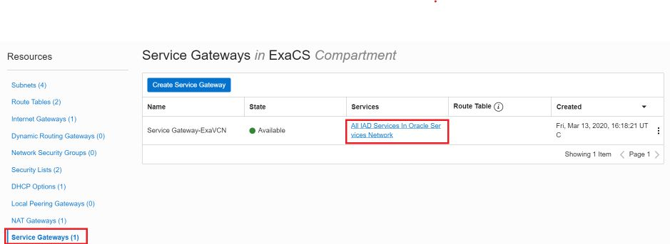 

Below diagram depicts an Oracle Cloud Infrastructure architecture with static route and service gateway.


### **Backup using Console**
**To configure Automatic backup through console:**
- Go to Oracle Cloud Infrastructure Home page and click on hamburger menu.


- Click **Bare Metal, VM, and Exadata**.


- Choose your **Compartment**. Here, DB System is in **EXACS** compartment. A list of DB Systems is displayed as below. 

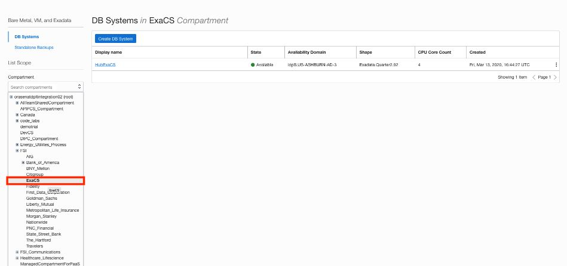
- Click on a DB system where the database is located. Here HubExaCS DB System is selected as below.

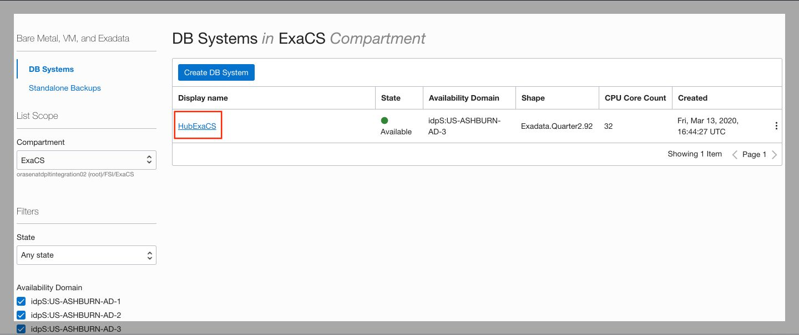
- General Information about DB System is displayed as below.

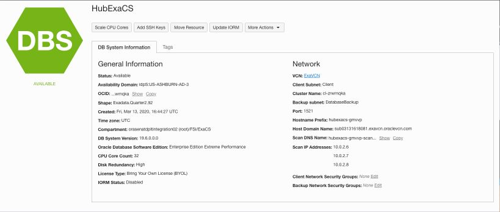

- A list of databases under the DB System is displayed as below,  when you scroll down.


- Click on a database you want to enable or disable automatic backups. The details in General Information indicate if automatic backup is enabled.


- Click **Configure Automatic Backups** as shown below.
    
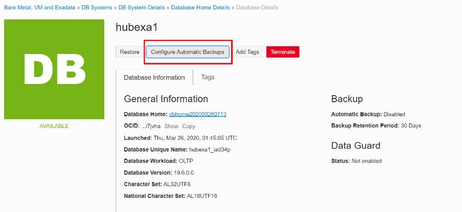

- In the **Configure Automatic Backups** dialog, check or uncheck **Enable Automatic Backup**, as applicable. If you are enabling automatic backups, you can choose one of the following preset retention periods: 7 days, 15 days, 30 days, 45 days, or 60 days. The default selection is 30 days. Click **Save Changes**.

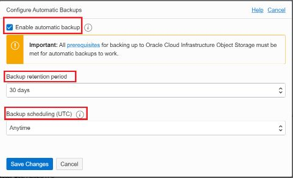

- You can view the backups from Backup Resources in DB page as below.


- Click **Create Backup** to create an on-demand full backup of a
database.


Click [here](https://docs.cloud.oracle.com/en-us/iaas/Content/Database/Tasks/exabackingup.htm), for more details on Managing Exadata DB Backups.

### **Recover using Console**

As mentioned above in Backup using Console,
- Go to Oracle Cloud Infrastructure Home page and click on hamburger menu.

- Click **Bare Metal, VM, and Exadata**.

- Choose your **Compartment**. A list of DB Systems will be displayed. 

- Click on a DB system where the database is located to be restored. A list of databases will be displayed.

- Click on a database you want to restore.

- Click **Restore** as shown below.

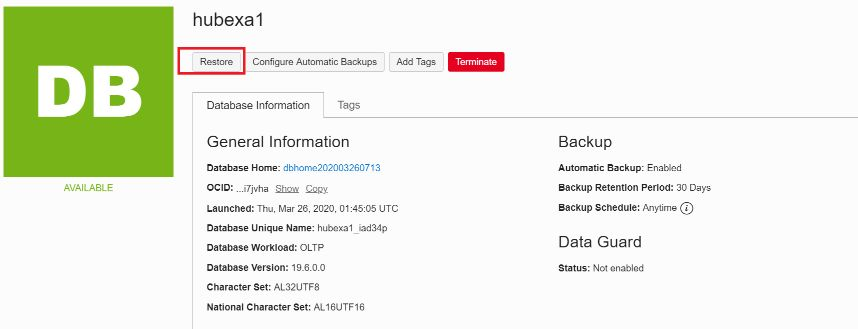

- Select one of the following options and click **Restore Database** as shown below.


    **Restore to the latest:** Restores the database to the last known good state with the least possible data loss.

    **Restore to the timestamp:** Restores the database to the timestamp specified.

    **Restore to System Change Number (SCN):** Restores the database using the SCN specified. This SCN must be valid.

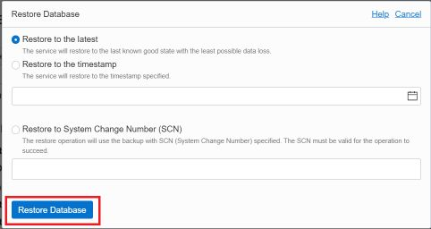

**Note: You can determine the SCN number to use either by accessing and querying your database host, or by accessing any online or archived logs.**
- Confirm when prompted. DB status will show a status "Updating" as shown below. 

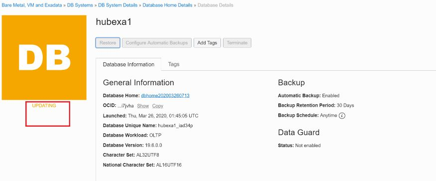

- Once restore is complete, it will show a status "Available" as shown below.

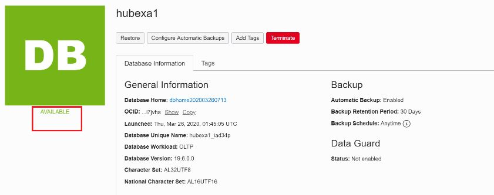

**Note: If the restore operation fails, the database will be in a \"Restore Failed\" state. You can try restoring again using a different restore option. However, Oracle recommends that you review the RMAN logs on the host and fix any issues before reattempting to restore the database. These log files can be found in subdirectories of the /var/opt/oracle/log directory.**


### STEP 2: Backup and Recover using API

You can use Exadata's backup utility, bkup\_api, to back up databases on an Exadata DB system to an existing bucket in the Oracle Cloud Infrastructure Object Storage service and to the local disk Fast Recovery Area.

**Pre-requisites**

- Object Storage:

    The Exadata DB system requires access to the Oracle Cloud Infrastructure Object Storage service with an existing Object Storage bucket to use as the backup location. You can create bucket from OCI (Oracle Cloud Infrastructure) Console.

    Click [here](https://docs.cloud.oracle.com/en-us/iaas/Content/Object/Tasks/managingbuckets.htm) for more details on how to manage buckets in OCI.  
- Auth Token:

    You can create an auth token generated by Oracle Cloud Infrastructure from OCI Console for enabling a user to access resources on OCI.

    Click [here](https://docs.cloud.oracle.com/en-us/iaas/Content/General/Concepts/credentials.htm\#Swift) for more details on working with Auth Tokens.
- Tenancy access:

    A username specified in the backup configuration file must have tenancy-level access to Object Storage. Administrator should create a policy as follow to limit access to only required resources in Object Storage for backing up and restoring the database.

```
<copy>Allow group <group_name> to manage objects in compartment <compartment_name> where target.bucket.name = <bucket_name>

Allow group <group_name> to read buckets in compartment <compartment_name></copy>
```
Click [here](https://docs.cloud.oracle.com/en-us/iaas/Content/Identity/Concepts/policygetstarted.htm) for more details on working with policies in OCI

### **Backup using API**

**To install backup configuration and schedule backup Using bkup_api**

 **Note: The following procedure must be performed on the first compute node in the Exadata DB system. To determine the first compute node, connect to any compute node as a grid user and execute the following command:**
 
```
<copy>$ORACLE_HOME/bin/olsnodes --n</copy>
```
- SSH to the first compute node in the Exadata DB system.
```
<copy>ssh -i <private_key_path> opc@<node_1_ip_address></copy>
```

- Log in as opc and sudo to the root user.

- Create a new backup configuration file in /var/opt/oracle/ocde/assistants/bkup/ as shown in the sample configuration file below. 
This example uses the file name bkup.cfg. You can provide your own file name. The following file schedules a backup to both local storage and an existing bucket in Object Storage.

```
<copy>cd /var/opt/oracle/ocde/assistants/bkup/
vi bkup.cfg

bkup_disk=yes

bkup_oss=yes

bkup_oss_url=https://swiftobjectstorage.<region>.oraclecloud.com/v1/companyabc/DBBackups

bkup_oss_user=<oci_user_name>

bkup_oss_passwd=<password>

bkup_oss_recovery_window=7

bkup_daily_time=06:45

bkup_cron_entry=yes</copy>
```

- We used file name bkup.cfg.hubex1.

**Please note bkup\_oss\_passwd entry will be removed automatically from the file after installation.**

-   After performing necessary changes, the end result file will look like below.


- Change the permissions of the file as follow.

```
<copy>chmod 600 bkup.cfg.hubexa1</copy>
```

- Use following command to install the backup configuration, configure the credentials, schedule the backup, and associate the configuration with a database name.

```
<copy>./bkup -cfg bkup.cfg.hubexa1 -dbname=hubexa1</copy>
```

- The backup is scheduled via cron and can be viewed at /etc/crontab as shown below.


- When the scheduled backup runs, you can check its progress with following command.

```
<copy>cd/var/opt/oracle/bkup_api/bkup_api bkup_status</copy>
```

Click [here](https://docs.cloud.oracle.com/en-us/iaas/Content/Database/Tasks/exabackingupBKUPAPI.htm) for more details on managing Exadata DB Backups using bkup_api.

**To create an on-demand backup**

You can use the bkup_api utility to create an on-demand backup of a database.

You can let the backup follow the current retention policy or you can create a long-term backup that persists until you delete it:

a)  To create a backup that follows the current retention policy, enter following command:

```
<copy>/var/opt/oracle/bkup_api/bkup_api bkup_start--dbname=<database_name></copy>
```

In this example, a backup following a current retention policy is created as shown below.


b)  To create a long-term backup, enter following command:

```
<copy>#/var/opt/oracle/bkup_api/bkup_api bkup_start --keep--dbname=<database_name></copy>
```

c)  For other on demand backup options, enter following command.

```
<copy>#/var/opt/oracle/bkup_api/bkup_api --help</copy>
```

**To list backups**

To list the available backups, execute following command as root user.

```
<copy># /var/opt/oracle/bkup_api/bkup_api recover_list--dbname=<database_name></copy>
```

In this example, backups are listed as shown below.


**To delete a local backup**

To delete a local backup, execute following command as root user.

```
<copy>/var/opt/oracle/bkup_api/bkup_api bkup_delete--bkup=<backup-tag> --dbname=<database_name></copy>
```

where backup-tag is a tag of the backup you want to delete.

**To delete a backup in ObjectStorage**

To delete a backup from the Object Store, use the RMAN delete backup command.

### **Recover using API**

bkup_api utility provides following options for recovery.

-   backup tag

-   SCN

-   PITR

-   Latest Backup

1.  Execute following command to get available recover options with syntax .Select an option as per your requirement.

```
<copy>#/var/opt/oracle/bkup_api/bkup_api recover_start --dbname hubexa1</copy>
```


2.  Execute recovery command with required option as follow. Here, we recover DB to latest available backup with option.

```
<copy>#/var/opt/oracle/bkup_api/bkup_api recover_start --latest--dbname hubexa1</copy>
```


3.  Execute following command to check recovery status.

```
<copy>#/var/opt/oracle/bkup_api/bkup_api recover_status--dbname=hubexa1</copy>
```

In this example, recovery completion status is checked as shown below.

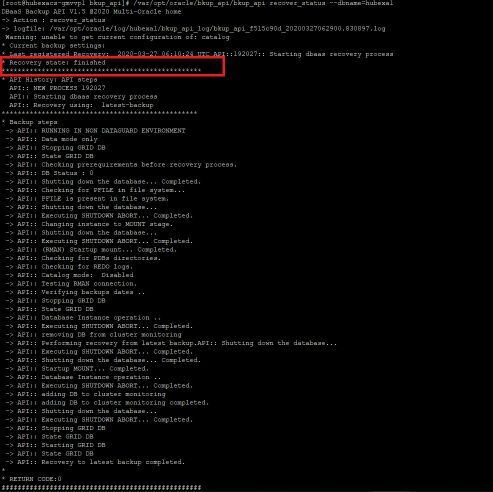


**Note: you can find the recovery logs in /var/opt/oracle/log/\<dbname\>/orec**

### STEP 3: Backup and Recover using RMAN

[Backup and Recover using RMAN # 306](./Appendix.md) 
