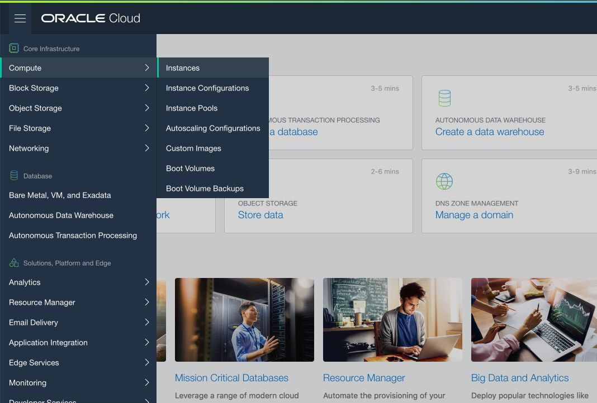
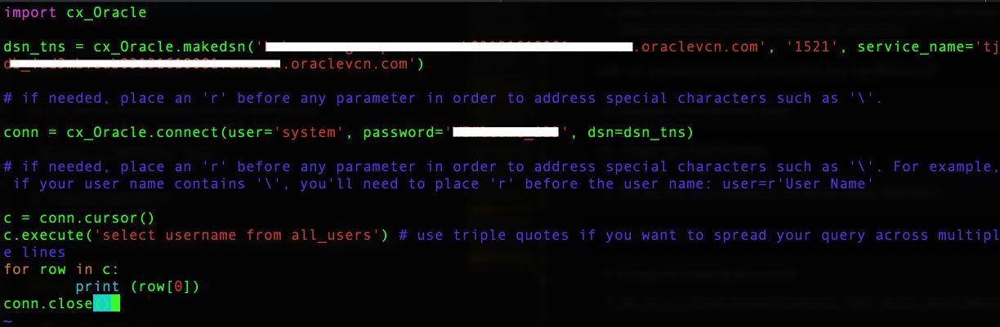
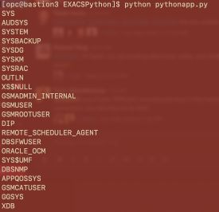

<table class="tbl-heading"><tr><td class="td-logo">

March 31, 2020
</td>
<td class="td-banner">
# Lab 16: Building and deploying Python application stacks on EXACS infrastructure
</td></tr><table>

## Introduction

The Oracle Cloud Infrastructure marketplace provides a pre-built image with necessary client tools and drivers to build applications on EXACS databases. As an application developer you can now provision a developer image within minutes and connect it to your database deployment.

The image is pre-configured with tools and language drivers to help you build applications written in node.js, python, java and golang.
For a complete list of features, login to your OCI account, select 'Marketplace' from the top left menu and browse details on the 'Oracle Developer Cloud Image'

**In this lab we will configure and deploy a python application in a developer client VM and connect it to an EXACS database.**


To **log issues**, click [here](https://github.com/oracle/learning-library/issues/new) to go to the github oracle repository issue submission form.

## Objectives

As an application developer,
- Learn how to deploy a python application and connect it to your EXACS database instance

## Required Artifacts

- An Oracle Cloud Infrastructure account

- A pre-provisioned instance of Oracle Developer Client image in an application subnet. Refer to [Lab 4](ConfigureDevClient.md)

- A pre-provisioned EXACS database instance. Refer to [Lab 3](./ProvisionDatabase.md)

- A network that provides connectivity between the application and database subnets. Refer to [Lab 1](./EXACS-Networking.md)

## Steps

### STEP 1: Download sample python application

- Login to your Oracle Cloud Infrastructure account and select **Compute** —> **Instances** from top left menu



- Select the right Oracle Developer Cloud image you created in [Lab4](ConfigureDevClient.md) 

- Copy the public IP address of the instance in a note pad. 


**Mac / Linux users**

- Open Terminal and SSH into linux host machine

```
sudo ssh -i /path_to/sshkeys/id_rsa opc@publicIP
```


**Windows users**

- You can connect to and manage linux host mahine using SSH client. Recent versions of Windows 10 provide OpenSSH client commands to create and manage SSH keys and make SSH connections from a command prompt.

- Other common Windows SSH clients you can install locally is PuTTY. Click [here](https://docs.microsoft.com/en-us/azure/virtual-machines/linux/ssh-from-windows) to follow the steps to connect to linux host machine from you windows using PuTTY.

**Download sample python Application**

In your developer client ssh session,

```
cd /home/opc/
```

Lets download a sample python application for the purpose of this lab,

```
wget https://objectstorage.us-ashburn-1.oraclecloud.com/p/k6hamruBC0UBdOdD081hxf7-qQSnQdOWnLp7PCrmt0o/n/orasenatdpltintegration02/b/ExaCSScripts/o/EXACSPython.zip
```

- Unzip the application 

```
unzip EXACSPython.zip
```


### STEP 2: Run your python application**


- Open terminal on your laptop and SSH into linux host machine. Windows users follows instructions provided above to ssh using Putty.

```
ssh -i /path/to/your/private_ssh_key opc@PublicIP
```

- Navigate to EXACSPython folder

```
cd /home/opc/EXACSPython
```

- Edit the dns_tns connection in the sample python application.

```
vi pythonapp.py
```



- Change the following parameters

1. dsn_tns = cx_Oracle.makedsn('Hostname', '1521', service_name='DBServiceName')
```
Hostname: DBUniqueName.DBHostname
Port: 1521
Service_name: Can be found in tnsnames.ora file
```

2. conn = cx_Oracle.connect(user='system', password='DBPassword', dsn=dsn_tns)

```
user: system
password: Database password
dns: dsn_tns
```

- That's all! Lets fire up our python app and see if it makes a connection to the database.

- In connection execute this application displayes all the users in the database.

```
 python pythonapp.py
```




<table>
<tr><td class="td-logo">[](#)</td>
<td class="td-banner">
### Congratulations! You successfully deployed and connected a python app to your EXACS database.
</td>
</tr>
<table>