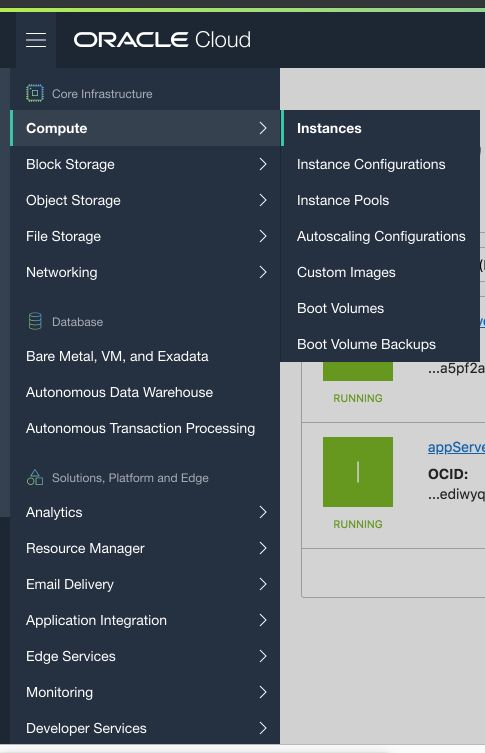
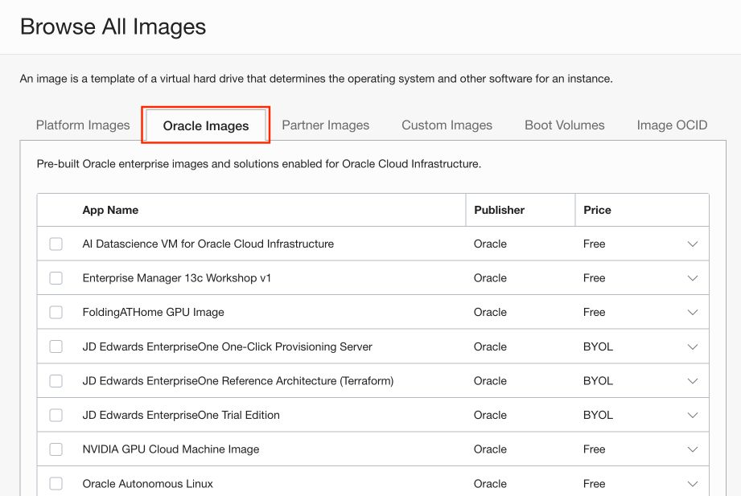
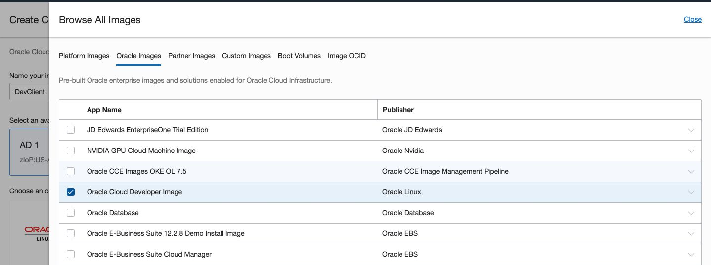
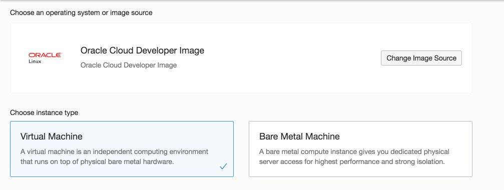
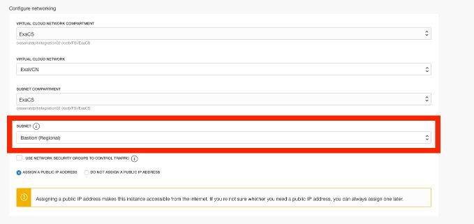
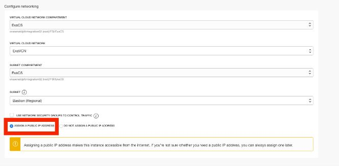
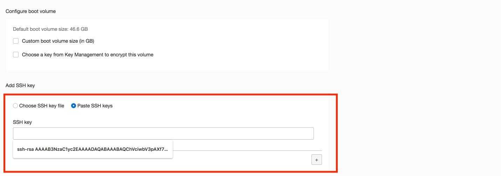
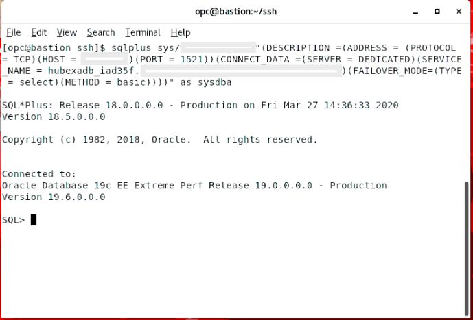

## Introduction
The Oracle Cloud Infrastructure marketplace provides a pre-built image with necessary client tools and drivers to build applications on Exadata Cloud Service databases. As an application developer you can now provision a developer image within minutes and connect it to your database deployment.

The image is pre-configured with tools and language drivers so that you can configure a secure connection using Oracle SQL Developer, SQLCL and SQL*Plus.
For a complete list of features, login to your OCI account, select 'Marketplace' from the top left menu and browse details on the 'Oracle Developer Cloud Image'


## Objectives

As a database user, DBA or application developer,
- Configure a development system from a pre-built marketplace image
- Create an ssh tunnel from your local laptop into your development system
- Invoke SQL Developer on your development system over a VNC connection from your local laptop 
- Configure a secure connection from your development system to your EXACS database using Oracle SQL Developer and SQL*Plus.

## Required Artifacts

- An Oracle Cloud Infrastructure account with IAM privileges to provision compute instances
- A pre-provisioned ExaCS database instance. Refer [Lab 3](./ProvisionDatabase.md) on how provision an EXACS database.
- VNC Viewer or other suitable VNC client on your local laptop

## Steps

### STEP 1: Provision a OCI Marketplace Developer Client image instance

We start with deploying a pre-configured client machine instance from the OCI marketplace

- Log into your cloud account using your tenant name, username and password
- Click Compute Instance in the left side menu under services



<br>

- Click **Create Instance**


<br>

- Specify a name for compute instance


<br>

- Choose **Change Image** and a pop-up will appear. Select the **Oracle Images** tab and then select **Oracle Cloud Developer Image** from Oracle Image section





<br>

- Choose instance type as **Virtual Machine**



<br>

- Choose VCN and subnet where you would like your client machine deployed. This would likely be the application subnet created in previous labs. 

**Note:**
**- Please ensure you have picked the right compartments where network resources exist.**



<br>

Ensure that **Assign A Public IP Address** button is selected. You would need to ssh into this instance over public internet.



<br>

- Add SSH key, you can choose to import ssh public key or paste ssh public key



- Within a few mins your developement instance will be available and a public IP address assigned (if it is provisioned in a public subnet)


<br>

- Once provisioned, you can click on the instance name to see details


<br>
<br>


### STEP 2: Connect to dev client desktop over VNC


First we shh into the dev client and invoke the VNC server that comes pre-installed.


- SSH into your dev client compute instance

```
<copy>
$ ssh -i <private-key> opc@PublicIP
</copy>
```

- Change the password on the VNC server
   
```
<copy>
$ vncpasswd
</copy>
```
- Once you update the password, start your VNC server with the following command,

 ```
 <copy>
 $ vncserver -geometry 1280x1024
 </copy>
 ```

- Your development system may now be ready for accepting VNC connections

**Mac Users**

On your local laptop,

- Open a terminal window and create an ssh tunnel using the following command,

````
<copy>
$ ssh -N -L 5901:127.0.0.1:5901 -i \<priv-key-file\> opc@<publicIP-of-your-devClient>
</copy>
```

**Windows Users**
- Windows 10 users can use powershell to connect using command above.

- Alternatively, you may create and ssh tunnel using putty. Detailed instructions on using putty for ssh tunnels are provided in the [Appendix](./Appendix.md)


You now have a secure ssh tunnel from your local laptop to your developement system in OCI on VNC port 5901

**Note: As mentioned earlier, you need a VNC client installed on your laptop. This lab uses VNC Viewer**


Start VNC Viewer on your laptop and configure a client connection using the settings as shown


Note how the connect string for VNC Server is simply localhost:1  That is because the default port 5901 on your local machine is forwarded to 5901 on your OCI dev client over an ssh tunnel

Connect to your VNC desktop and provide the password you changed on the host earlier

If all goes well, you should now see a linux desktop in your VNC window.


### STEP 3: Connect to your database using SQL Developer and SQL Plus

In your VNC session, invoke SQL Developer from the top left Applications menu as shown below


**Note: In the event you have issues launching SQL Developer and it prompts with a java classpath error, simply add the following line to ~/.sqldeveloper/19.1.0/product.conf and retry**

```
<copy>
SetJavaHome /usr/java/jdk1.8.0_231-amd64
</copy>
```

Create an new connection in sql*developer and provide the following information,

**Connection Name**: Name for your connection

**Username**: sys

**Password**: <password>

**Connection Type**: Basic

**Role**: sysdba

**Hostname**: Private IP of the node in EXACS

**Port**: 1521

**Service name**: DatabaseUniqueName.HostDomainName (This can be found in the cloud console)


- Test your connection and save. The **Status** bar will show **Success** if it is a successful connection!

**Let's also test connectivity through some command line client tools like SQL*Plus**

**Connect to database instance using Oracle SQL Plus**

For SQL*Plus, you will need to have tnanames.ora to connect to your database from your Bastion Server-

You can either ssh into your EXACS VM to get the connection string (tnsnames.ora), or you could ask you DBA to provide you with the necessary details. 

- Open Terminal from you Bastion Server


- Type SQLPUS and enter the required details to connect it to your database

```
<copy>
sqlplus sys/DBpassword@"(DESCRIPTION =(ADDRESS = (PROTOCOL = TCP)(HOST = 'EXACS_VM_IP')(PORT = 1521))(CONNECT_DATA =(SERVER = DEDICATED)(SERVICE_NAME = databaseUniqueName.hostDomainName)(FAILOVER_MODE=(TYPE = select)(METHOD = basic))))" as sysdba
</copy>
```

**Note: Please make sure to change you Database Password, Host, Service_Name in the above command.**


- When succesfully connected, you should see similar to below image.



Great Work! You successfully created a client machine and connected to your EXACS database instance using SQL Developer and SQLPLUS.