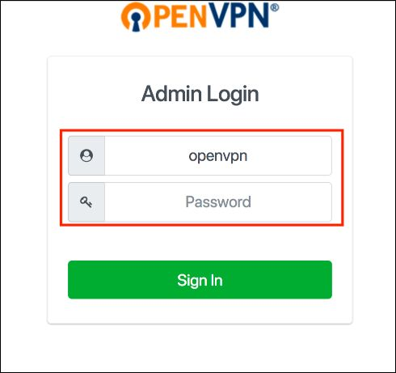
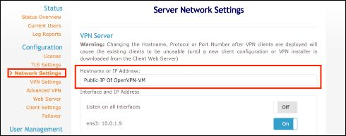
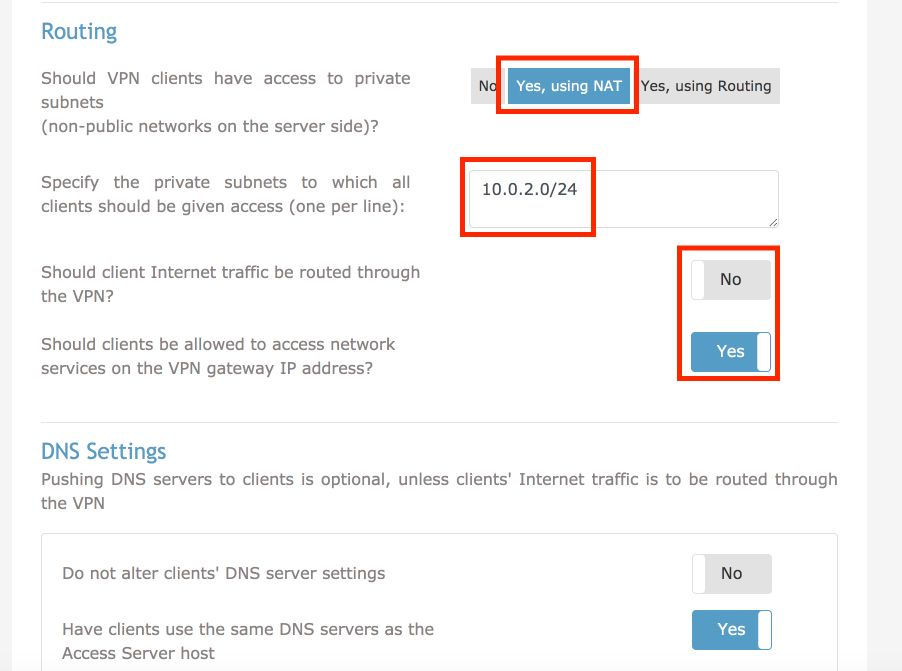
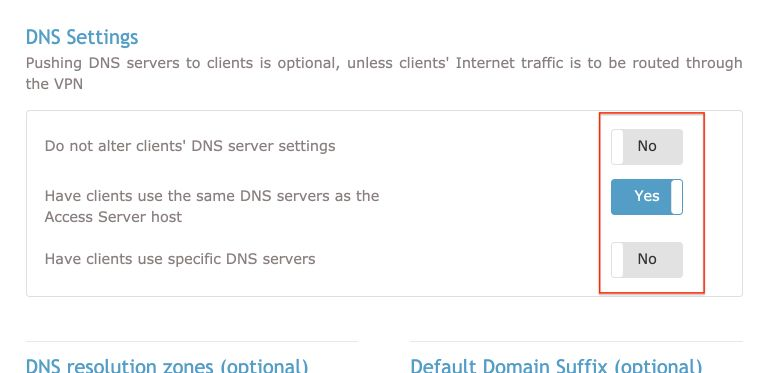
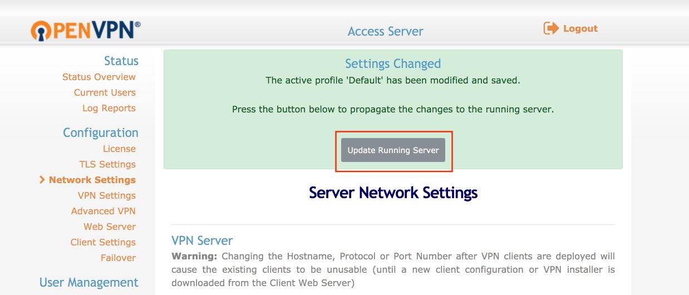
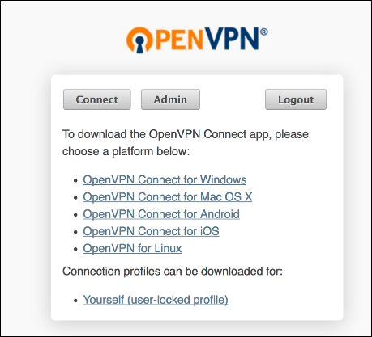
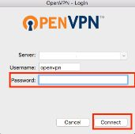
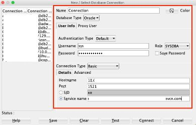
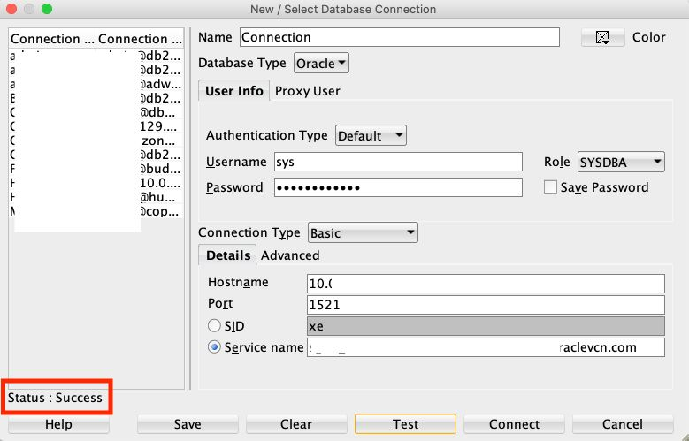

## Introduction

Oracle's Exadata Cloud Service (ExaCS) is deployed in a private VCN in the Oracle Cloud Infrastructure with no public IP address assigned. Hence to gain connectivity to the databases, a best practice approach is to use a VPN connection. 

This lab walks you through the steps to deploy a VPN server in OCI and create an SSL VPN connection between a client machine (your desktop) and the ExaCS infrastructure. Once configured, a single VPN server can be shared among multiple users.

## Objectives
As a network admin,

- Configure a VPN server in OCI based on OpenVPN software
- Configure your VPN client and connect to VPN Server
- Launch SQL Developer on client and connect to an ExaCS database node


## Required Artifacts

- An Oracle Cloud Infrastructure account with privileges to create compute instance and network resources
- A pre-provisioned ExaCS instance in a private network
- A pre-provisioned Virtual Cloud Network with public and private subnets setup with appropriate security lists. Refer to [Lab 1](./ATPD-Networking.md)


The following illustration shows a network topology that can be used to provide secure access to your EXACS infrastructure.


- As shown above, your OCI Virtual Cloud Network (VCN) has two subnets. A private subnet with CIDR 10.0.2.0/24 (for example that hosts your exadata infrastructure and a public subnet with CIDR 10.0.1.0/24 that has public facing web and application servers and also the VPN Server. 

- An internet gateway is attached to the public subnet to allow all resources within that subnet to be accessible over the internet.

- Security lists have been setup such that tcp traffic into the private exadata subnet is allowed only through hosts in the public subnet. This can be further tightened by allowing traffic from specific hosts and ports. 

- For detailed instructions on network setup for your ExaCS infrastructure, refer to [Lab 1](EXACS-Networking.md)


## Steps


### **STEP 1: Launch a CentOS VM for the OpenVPN server**

- Login to the Oracle Cloud Infrastructure using your tenancy, userId and password. 

    Refer to [Lab 1](EXACS-Networking.md) for detailed instructions on logging into your OCI account.

- Once logged in, Click on **Menu**, **Compute**, **Instances** and **Create Instance**


- Name your instance and select **CentOS7** as your image source 


- Select **Virtual Machine** and add your public SSH key file 


-  Next, select the network for your VPN Server
    - Select the compartment & VCN where your exadata infrastructure is provisioned
    - Select the compartment where your public subnet is provisioned
    - Pick public subnet from the drop down
    - Select "Assign a public IP address"
 
    


#### Note that while your ExaCS infrastructure and VPN server are in the same VCN, ExaCS is in a private subnet while the VPN server is deployed in a public subnet for access over the internet. 


-  Click Create and within a few mins your CentOS server will be ready with a public IP for ssh access


### **STEP 2: Install and Configure OpenVPN Server**

-   ssh into centOS vm and download the openVPN rpm package

```
<copy>
ssh opc@O<public_ipAddress_of_your_centOS_VM>
</copy>
```

```
<copy>
$ wget http://swupdate.openvpn.org/as/openvpn-as-2.5.2-CentOS7.x86_64.rpm
</copy>
```
   


-   Use the RPM command to install the package

```
<copy>
sudo rpm -ivh openvpn-as-2.5.2-CentOS7.x86_64.rpm
</copy>
```


-   Change password of OpenVPN Server

```
<copy>
sudo passwd openvpn
</copy>
```

-    From your local browser, access the admin UI console of your VPN Server (**https://<*public_ipAddress_of_your_centOS_VM*>:943/admin**), using the username as 'openvpn' and password for OpenVPN server.
 



-   Once you are logged in, click **Network Settings** and replace the **Hostname or IP address** with the public IP of the OpenVPN Server Instance



****Save your setting before advancing to the VPN settings page**

Click **VPN settings** and scroll down to the section labeled **Routing**

Here we configure how traffic from your VPN client (i.e. your personal laptop for example) shoud be NATed and how DNS resolution should occur.

Configure this section as shown in the screenshot below. 
- Choose **Yes using NAT**
- Provide CIDR ranges for your application and exadata subnets
- Pick 'No' for the question - **Should client internet traffic be routed through the VPN?**



Scroll down and configure the DNS settings as shown below.



**Save your setting before advancing to the VPN settings page**

- In the **Advanced VPN** section, ensure that the option **Should clients be able to communicate with each other on the VPN IP Network?** is set to **Yes**


Note: Once you have applied your changes, click **Save Settings** once again. Then, **Update Running Server** to push your new configuration to the OpenVPN server.




### **STEP 3: Install OpenVPN Client**

- Launch your OpenVPN Access Server Client UI at **https://*<Your_VPN_Server_Public_IP>*:943** and download the OpenVPN client for your platforms.
    


    

- Once the installation process has completed, you can see an OpenVPN icon in your OS taskbar. Right-Click this icon to bring up the context menu to start your OpenVPN connection


    
##### Note: IP should be Public IP for OpenVPN Compute Instance

- Click **Connect** brings up a window asking for the OpenVPN username and password. Enter the credentials for your **openvpn** user and click **Connect** to establish a VPN tunnel



You may also setup your VPN server with multiple users. Follow the OpenVPN configuration guide to setup additional users.

### **STEP 4: Connect SQL Developer to your ExaCS database**


Launch SQL Developer and connect as shown below:
- **Connection Name**: Enter a name for your ExaCS connection
- **Username**: Enter **sys**
- **Password**: Enter the password for one of the databases in the ExaCS
- **Connection Type**: Select **Basic**
- **Role**: Select **SYSDBA**
- **Hostname**: Enter the private IP of any of the nodes of your ExaCS instance
- **Port**: Enter **1521**
- **Service name**: Construct the service name as <*database-unique-name*>*.*<*Host_Domain_Name*>





Once you test, you should see "Success" in Status.



Congratulations! You just configured a secure VPN connection into your private Exadata Cloud Service infrastructure.
