## Introduction

Application Express (APEX) is a great tool to build Applications, REST API's on Oracle Database. It enables us to creates REST services which can be a single point of access for Developers. The DBA's can provide access to users like developers without even having to share the connection details adding more security to the database.

In this lab, you are going to create a REST service which you will use in the next lab, to send data from a Python Application into Oracle Database.


To **log issues**, click [here](https://github.com/oracle/learning-library/issues/new) to go to the github oracle repository issue submission form.

## Objectives

- Learn how to build REST services using APEX.

## Required Artifacts

- Please ensure you have installed ORDS and APEX on the database instance you want to create a REST service. Refer [Part-1](SetupORDSandAPEXonDBCS.md) for more information.


## Steps

### **STEP 1: Log into APEX and create a new workspace**

- Log into your APEX account using the default workspace.

    - **Workspace**: internal
    - **user**: admin
    - **password**: <DB sys password>
    
    This is the same password we used while running the terraform script.

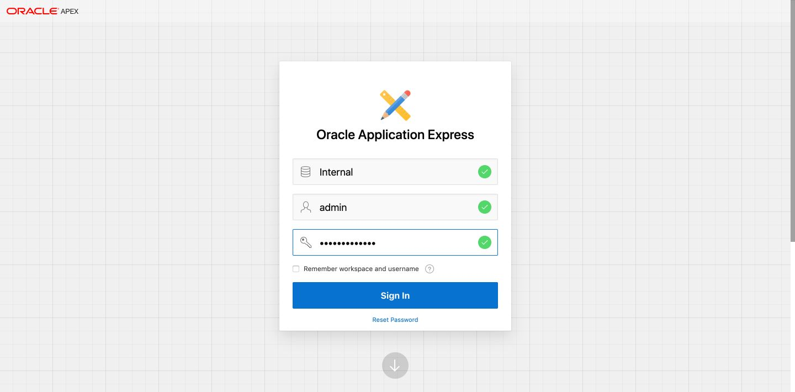

- Rest the password when prompted

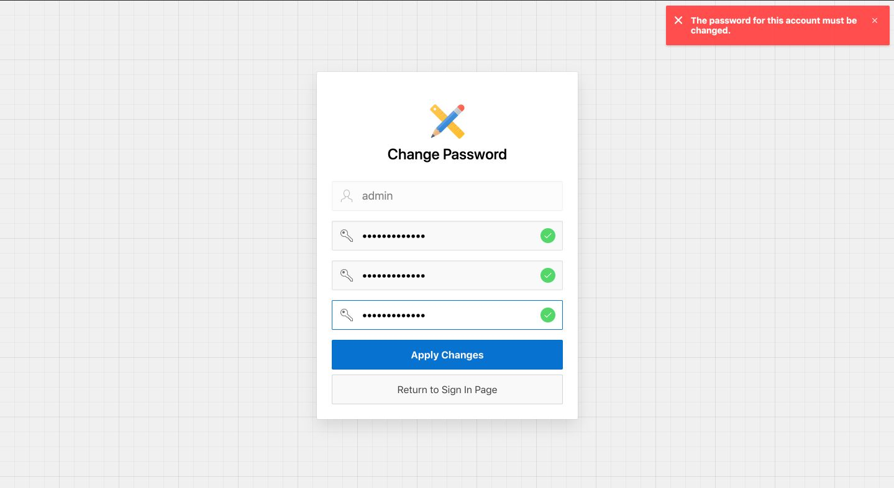

- Click **Create Workspace** button on top right corner of the page.

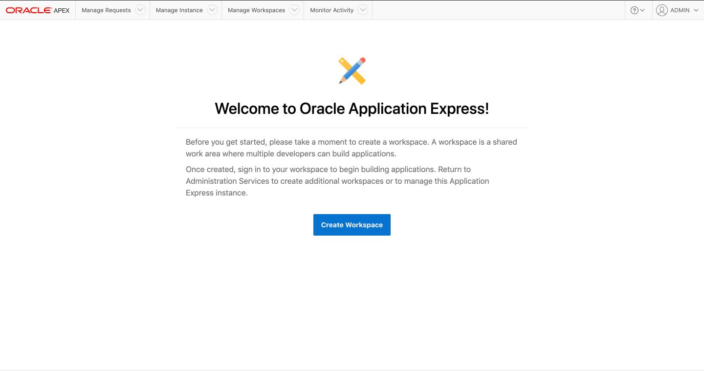

- Enter Workspace Name and ID and click **next** button.

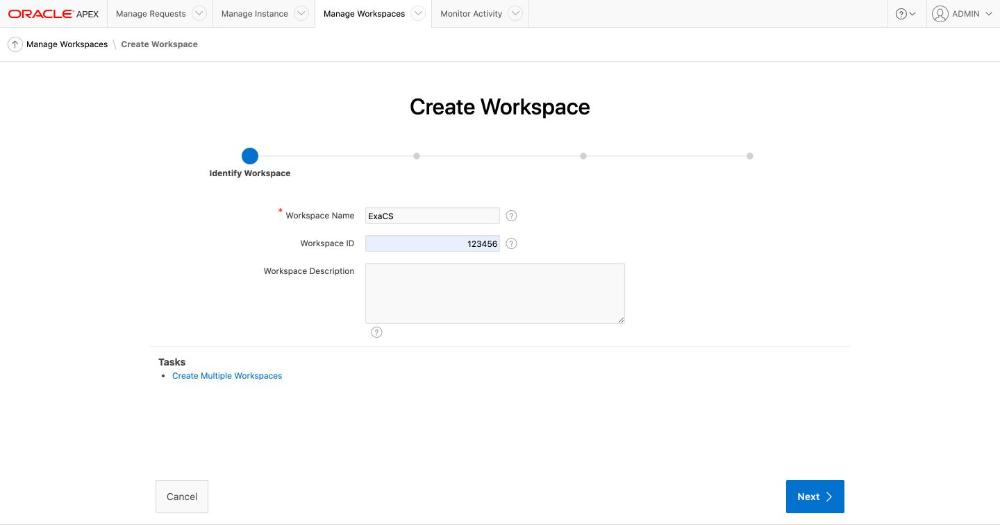

- Select YES from the dropdown for Re-use existing schema.
- Select the schema we created earlier from the list.
- Enter the schema password.
- Select the space quota for the schema.


- Click **Next**.

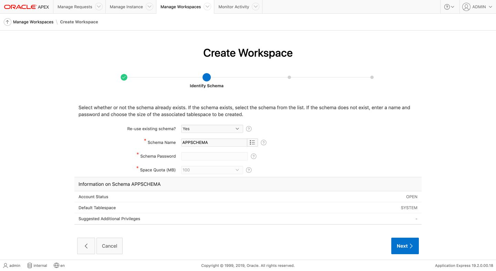

- click **Next**
- enter admin password
- enter first name and last name for the apex user.(Optional)
- enter the email.
- click **next**.

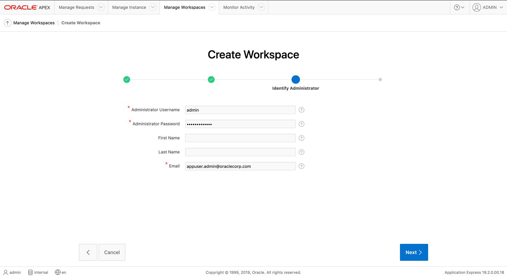

- Review the details and Click **Create Workspace**.

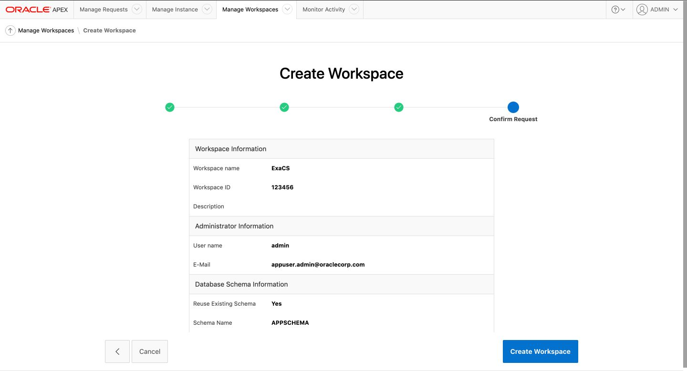
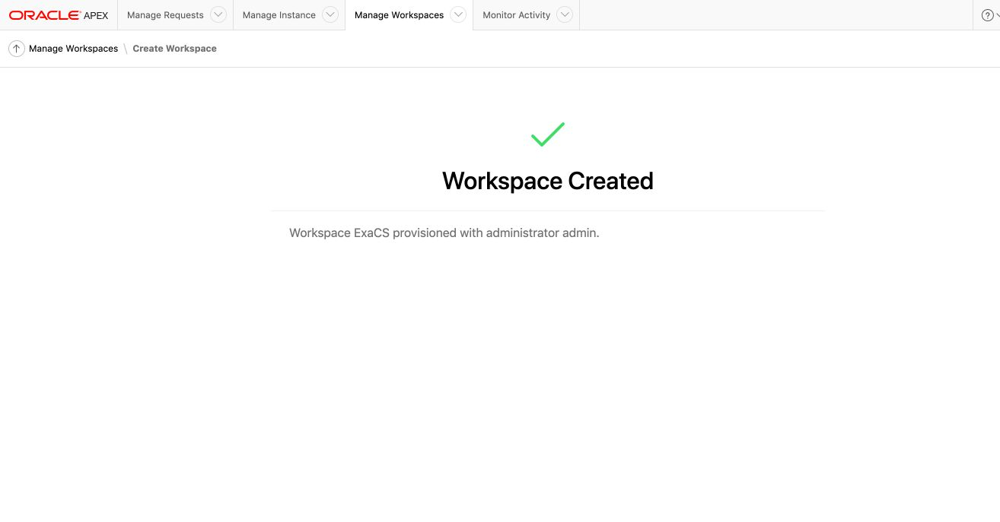

- Now logout and login using the workspace we just created. Reset the password if prompted.

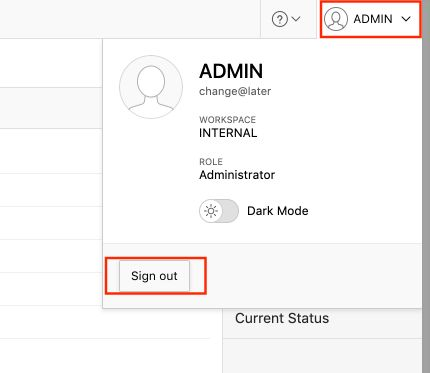
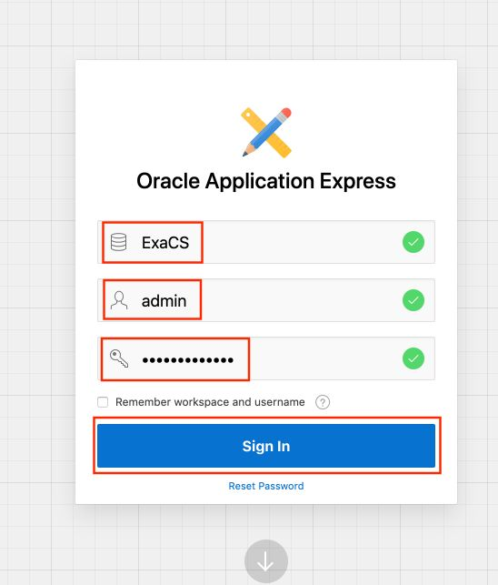
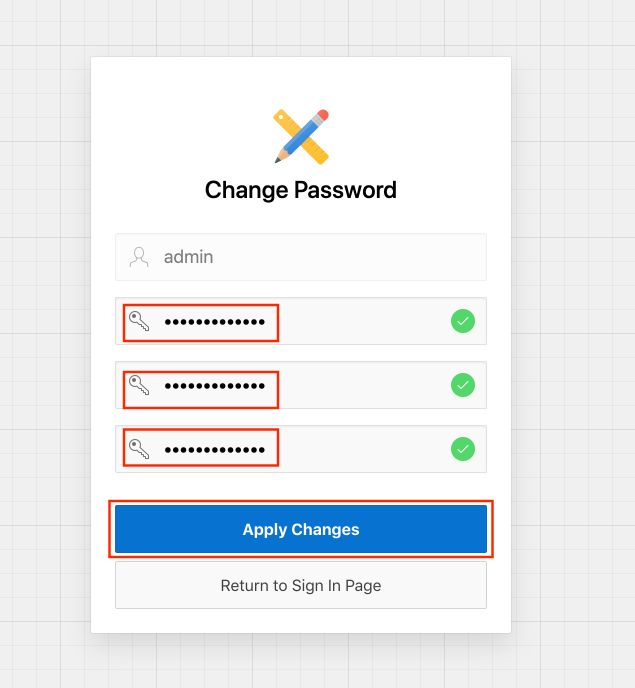

- Click on SQL Workshop  and then on RESTful Services tab and Click **Register schema with ORDS**  button, if prompted.


- A Pop-up window opens up. Select yes for enable restful services option, select  No for Install Sample service and select No for authorization required option. Click **Save Schema Attributes**.

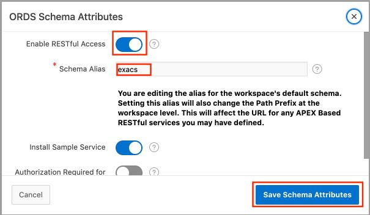


- Click on **Modules** on the left panel.

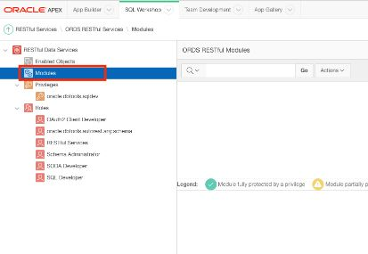

- Click **Create Module** on top right of the screen.
- Enter the Module name and the Base Path of your choice. Click **Create Module** button.


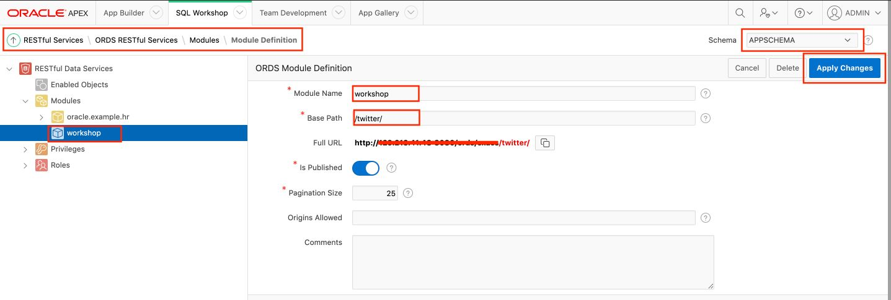

- Now, on the Module Definition page. Click **Create Template** on right side of the screen.

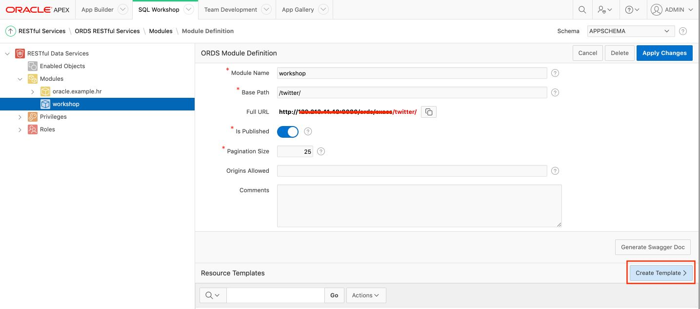

- On the Template Definition Page, enter the URI template of your choice. Click **Create Template**.


- Now you will see a message on the top of the screen confirming that the Template is created.

- Now, click **Create Handler** button on right side of the screen.

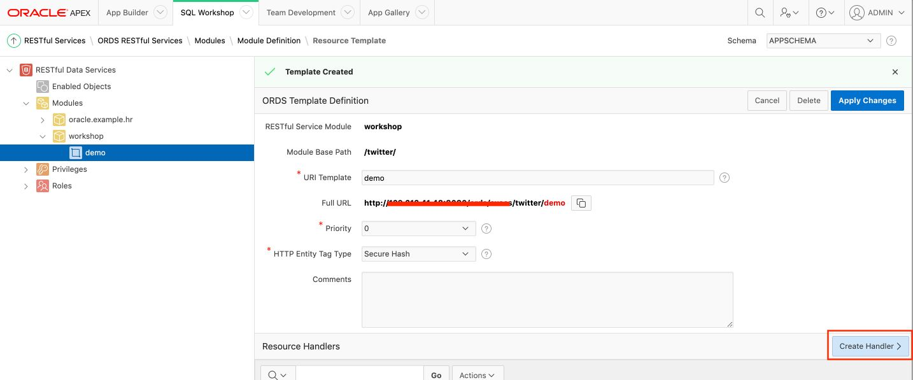

- On the Handler Definition page, select the **Method** as GET and select the **Source Type** as PL/SQL from the dropdown.

-  Now, enter the below PL/SQL procedure in the **source** section below the comments box. This procedure will create a get request to extract data from the table containing tweets.

```
    <copy>begin
      apex_json.open_array;
      for c in ( select * from jsontweets ) loop
        apex_json.open_object;
          apex_json.write( 'timestamp', to_char( c.ts, 'yyyy/mm/dd hh24:mi:ss') );
          apex_json.write( 'tweet', c.tweetjson );
        apex_json.close_object;
      end loop;
      apex_json.close_array;
    end;</copy>
```

    **Note : we will create the tables we are referencing here in the next part of this lab**

- Now, click **Create Handler** button on top right of the page.

- Now, click on the template you created from the panel on the left side.


- Now, click on **Create Handler** button on right side of the screen again.


- Select the **Method** to be POST and copy the below PL/SQL procedure

```
  <copy>begin
    insert into jsontweets (ts, tweetjson) values (sysdate, :body);
  end;</copy>
```

   **Note : we will create the tables we are referencing here in the next part of this lab**

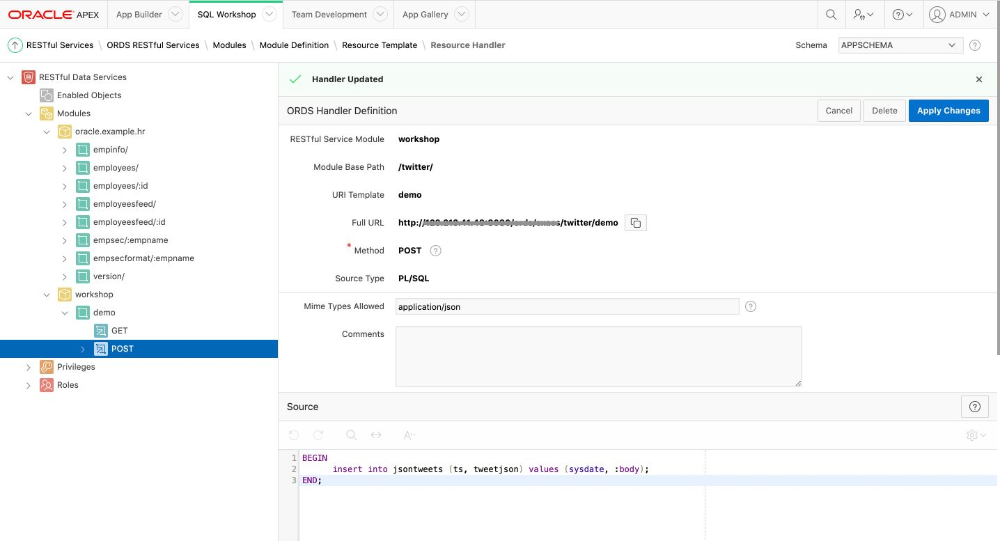

- Scroll back up and click **Create Handler**.

- Copy the REST Endpoint by clicking on the copy button beside the Full URL on the Handler's Definition Page. 

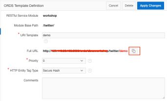

- Now, your REST Service is ready!

- You are going to use this REST endpoint in the Python Application in the next lab.


-   You are now ready to move to the next part of this lab.
