## Introduction

In this lab, you will be installing 2 python applications and load tweets into the Oracle Database.

You can load data into Oracle Database by multiple methods but in this exercise we will use the Python SDK and a REST Service to load tweets.

This lab shows how to integrate the SDK and a REST Service with the Python application and use it to load data from Python Application to Oracle Database.

- The First Python Application will upload data to oracle database using the Python SDK. This application will parse tweets and unpacks the tweets from a file using the Python SDK for Oracle DB before uploading it to the database.

- The second Python Application will upload tweets in the form of JSON objects using the REST Service we created in the earlier exercise. Please refer **Lab 16-2** for more information. 

- To Demonstrate the native JSON support in Oracle Database, we will then create an APEX application which will directly extract data from these JSON objects without having to parse them first like any other data structure within the database.

To **log issues**, click [here](https://github.com/oracle/learning-library/issues/new) to go to the github oracle repository issue submission form.

## Objectives

- Learn how to load JSON data into Oracle Database using the Python SDK and a REST Service.
- Learn how to create a sample apex application on top of that data.
- Demonstrate native JSON support in oracle database.

## Required Artifacts

- Please ensure you completed the previous parts of this lab before you start this lab. Refer [Lab 16-1](?lab=lab-16-1-install-ords-apex) and [Lab 16-2](?lab=lab-16-2-create-restservice-on-database) for more info.

## Steps

### **STEP 1: Download the Python Applications**

- For this lab, you can download the application available in the following repositories. 

- ssh into the developer client we provisioned in lab-4.

```
<copy>ssh -i <path_to_private_ssh_key> opc@PublicIP</copy>
```

```
<copy>cd /home/opc/</copy>
```

```
<copy>mkdir apex</copy>
```

```
<copy> cd /home/opc/apex</copy>
```

- Download python application and parameters files in **/home/opc/apex/** folder as shown below.

```
<copy>wget --no-check-certificate --content-disposition https://github.com/oracle/learning-library/blob/master/data-management-library/exacs/scripts/pythonApp/jsonapp.py?raw=true</copy>
```

```
<copy>wget --no-check-certificate --content-disposition https://github.com/oracle/learning-library/blob/master/data-management-library/exacs/scripts/pythonApp/parameters.txt?raw=true</copy>
```

    - You will see:
        - Python Application: **jsonapp.py**
        - Config file: **parameters.txt**

    **Note : This Application will store the data in "TWEETSDATA" table which you can use to verify that the data is loaded**


- Download python application and json files as shown below. Copy files to the developer client we provisioned in lab-4 for our database.

```
<copy>wget --no-check-certificate --content-disposition https://github.com/oracle/learning-library/blob/master/data-management-library/exacs/scripts/pythonApp/pythonapp.py?raw=true</copy>
```
```
<copy>wget --no-check-certificate --content-disposition https://github.com/oracle/learning-library/blob/master/data-management-library/exacs/scripts/pythonApp/testjson.json?raw=true</copy>
```


    - You will see:
        - Python Application: **pythonapp.py**
        - Tweet Dataset file: **testjson.json**

    **Note : This Application will store the data in "JSONTWEETS" table which you can use to verify that the data is loaded**

### **STEP 2: Setting up the configuration file for the Python App**

- The Python Application you installed is going to load the tweets from tweets stores in JSON format into the Oracle Database.

- Since, JSON is natively supported by the Oracle Database. You don't have to worry about reformatting the JSON object or parsing the JSON object to extract the data and then store it. You can directly store the JSON objects in the Oracle database.


- Now, Modify the application config to work with your environment.

- Navigate to the folder where you have unzipped the application.

- open the config file

```
<copy>vi parameters.txt</copy>
```

- change all the parameters based on your environment.

```
<copy>jsonfile=<file containing Tweets>.json
ip=<DB IP>
port=<DB Port>
service=<DB Service Name>
sys_password=<Database SYS Password></copy>
```


### **STEP 3: Running the Python Applications**

- Make sure you are in the folder with the Python App.

- Run the First Python App.

```
<copy>python jsonapp.py parameters.txt</copy>
```
    
- Run the script.


- verify that the tweets are being stored in the database by connecting to the database, using SQL Developer, as the same user for which you created the REST Service.

- Run the second Python App.

    - This app will directly store JSON objects in Oracle Database because JSON data is natively supported in Oracle Database.

```
<copy>python3 pythonapp.py <REST Endpoint URL> <JSON File Name with extension></copy>
```


- verify that the tweets are being stored in the database by connecting to the database, using SQL Developer, as the same user for which you created the REST Service.


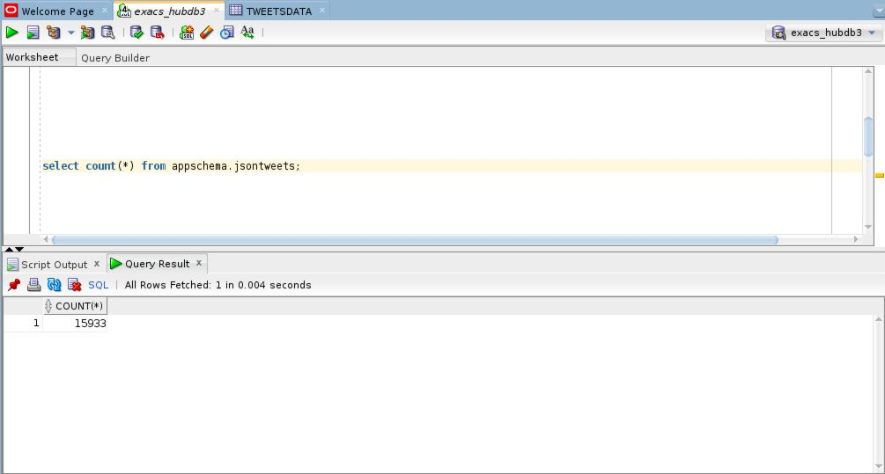

- Alternatively, you can also verify using the REST GET request as shown below.

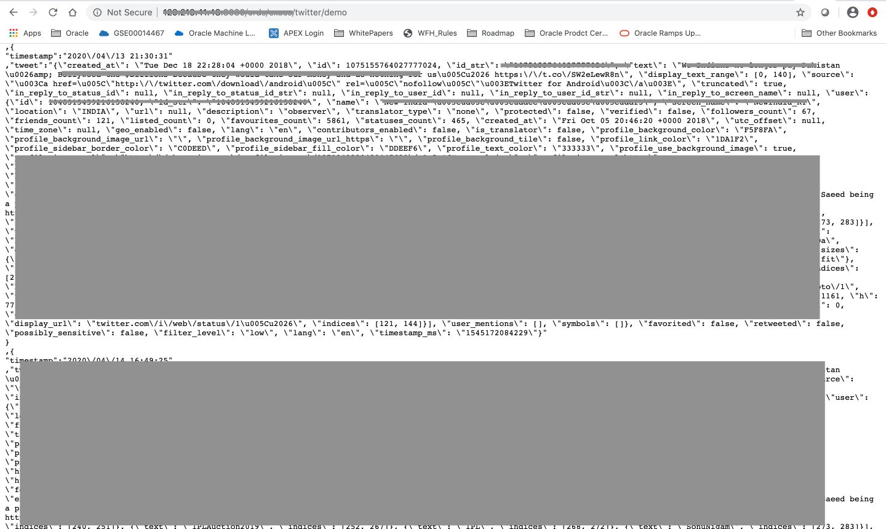

- Now lets log in to APEX installed on Oracle Database and create an application.

### **STEP 4: Create an APEX Application**

- Login to APEX using the following URL : 
   http://<ip_address>:\<ORDS Port\>/ords
   


- Click on Create an Application tab and then click on New Application option.


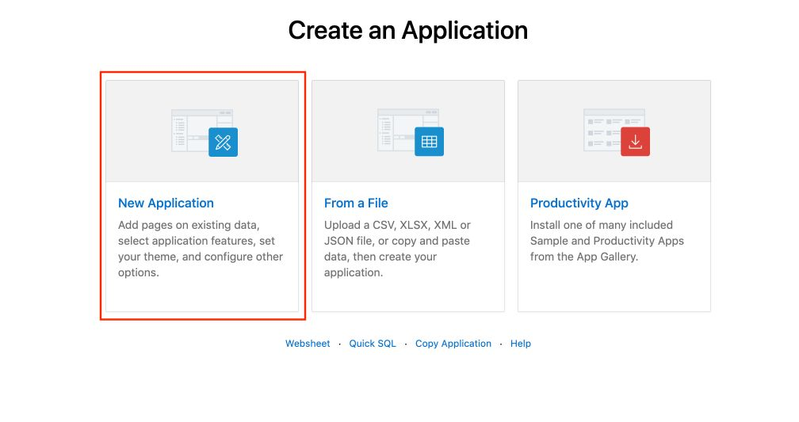

- Enter the name for the application and click on "Add Page" to add a page to the application.

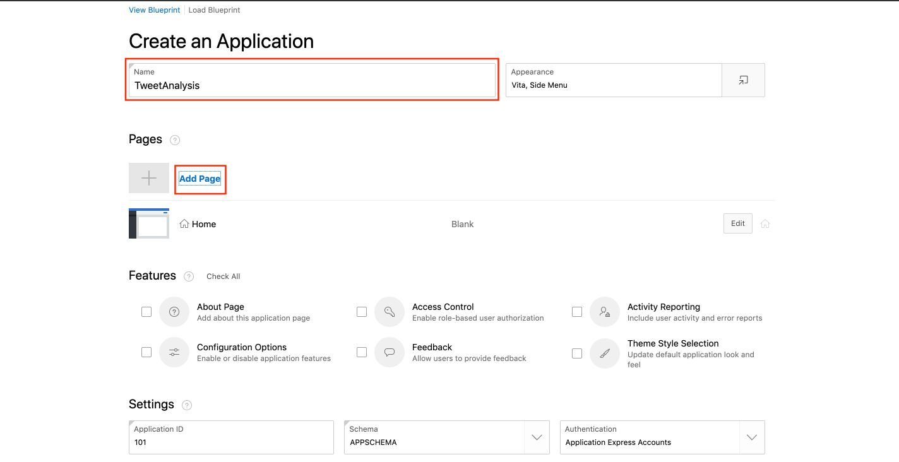

- Select Interactive Grid from the options.


- Enter a name for the Page, Select the "Table or View" option and make sure the "Interactive Report" option is selected. Select the correct table (which is TWEETSDATA for us) by click on the button beside the field. Finally click on Add Page button.
   
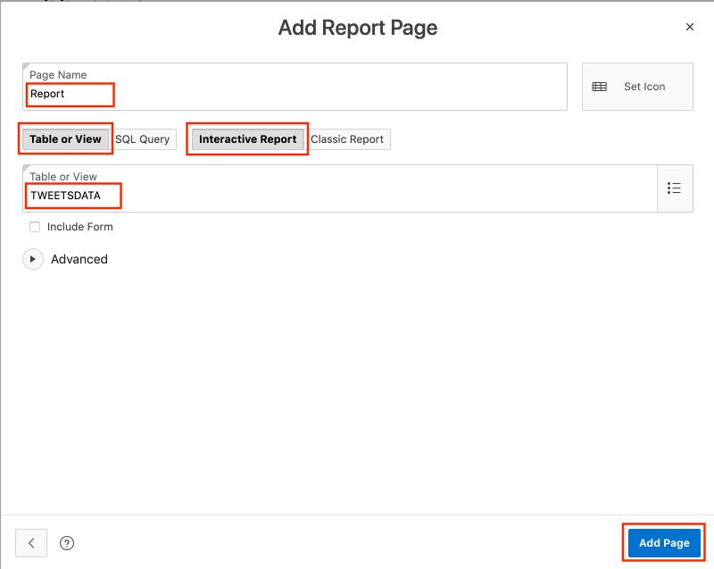

- Observe that a new page has been added to the application


- Similarly, click on Add Page option again and select Interactive Grid option.

- **This page will display the data extracted from the json objects, ingested into the Oracle database using the REST Service in the previous step, using a simple sql statement. Since JSON is natively supported in oracle database, it is really simple to deal with data in JSON format.**


- Enter a name for the Page, Select the "SQL Query" option and make sure the "Interactive Report" option is selected. Enter the query mentioned below in the query box. Finally click on Add Page button.

```
<copy>SELECT a.tweetjson.created_at, a.tweetjson.id, a.tweetjson.text, a.tweetjson.source, a.tweetjson.place, a.tweetjson.retweet_count, a.tweetjson.retweeted FROM   appschema.jsontweets a;</copy>
```

    **Note : As you can see in this query, since JSON is supported natively in Oracle Database, we can very easily extract data from JSON objects using the dot notation.**

    - Here in this example, we have extracted the attribute tweet id from the JSON object as follows :
    \<tablename\>\.\<column_consisting_json_object\>\.\<attribute_to_be_extracted\>

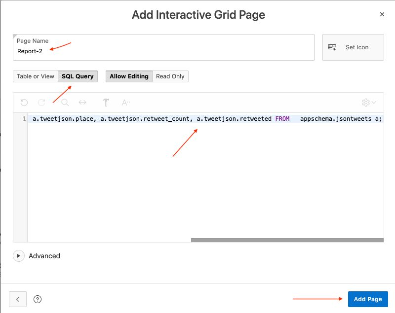
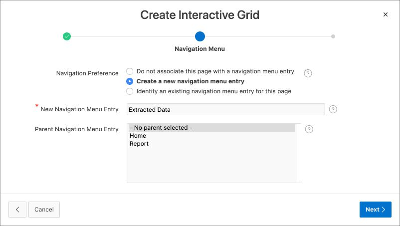
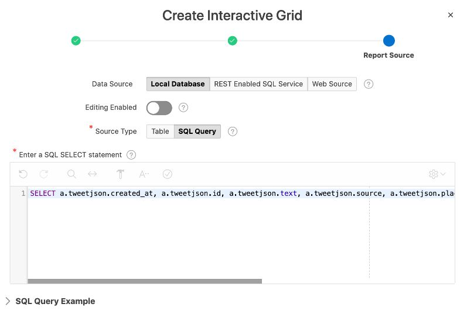

- Select APPSCHEMA user under the settings section and click Create Application

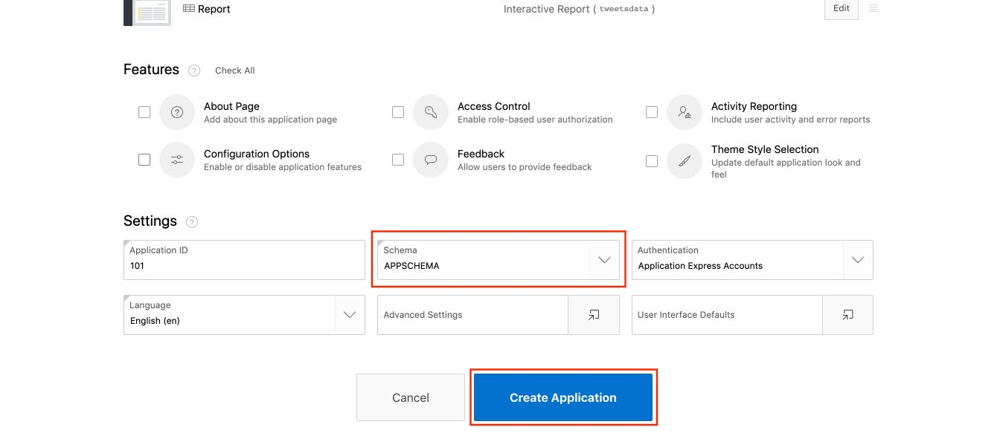

- Observe that the application has been created under the apps builder tab.

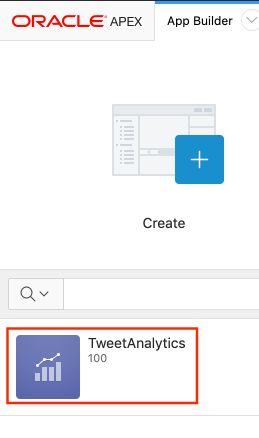

- Click on the application and click on the Run Application button on top right corner of the screen.

- On the Panel on left side, click on Report Page under Home to see the data we loaded into the database. This page loads the data up-loaded by the first python application

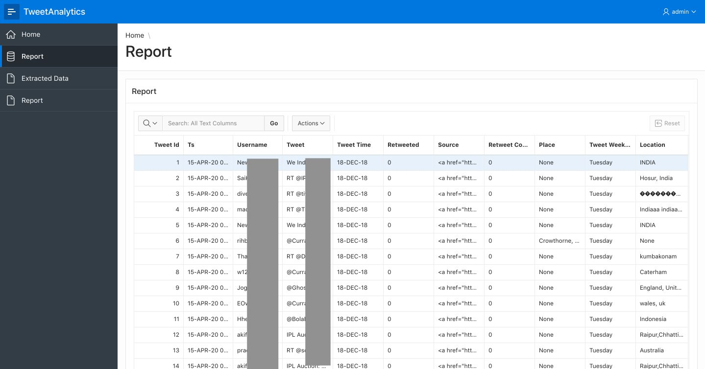

- Similarly, click on the Extracted Data option on the same panel to see the data we loaded using the REST Service.

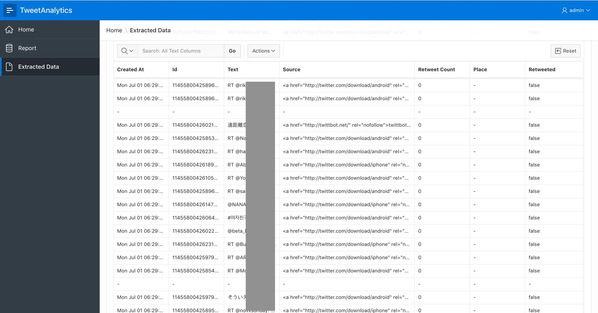

- You have now successfully loaded data using an SDK, send GET and POST data requests using REST Service and also created a Web Application using APEX and ORDS on top of the loaded data.

**Congratulations!! you have successfully setup ORDS and APEX and built a sample application.**
