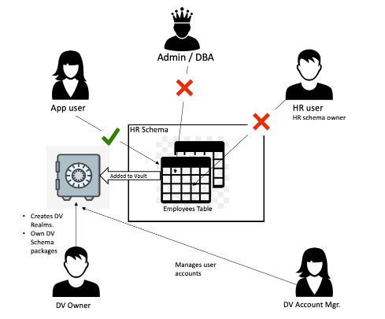

## Introduction

Oracle Network/SQLNet Encryption protects data in flight. This feature protects your data from administrators who have or hackers that gain access to the hardware such as switches and/or routers. For example, Oracle owns, need and have access to all hardware on the ExaCC rack(s) that include switches in the customer data center in order to properly maintain them to provide the services. Similarly, TDE (Transparent Data Encryption) protects your data at rest from admins who have/gain access to the compute and/or storage cell nodes. In addition, Database Vault Protects your data in processing from privileged access. Both SQLNet Encryption and TDE are included and enabled by default and automatically out of the box. This means that customer does not need to do anything themselves. However, Database Vault needs to be configured outside of the cloud automation.

Managed database services run the risk of 'Admin snooping', allowing privileged users access to customer data. Oracle Exadata Cloud Service provides powerful security controls within your database, restricting access to application data by privileged database users, reducing the risk of insider and outsider threats and addressing common compliance requirements.

You can deploy controls to block privileged account access to application data and control sensitive operations inside the database. Trusted paths can be used to add additional security controls to authorized data access and database changes. Through the runtime analysis of privileges and roles, you can increase the security of existing applications by implementing least privileges and reducing the attack profile of your database accounts. IP addresses, usernames, client program names and other factors can be used as part of Oracle Database Vault security controls to increase security.  Oracle Database Vault secures existing database environments transparently, eliminating costly and time consuming application changes.

**For more information, refer to the [Database Vault Administrator's Guide](https://docs.oracle.com/en/database/oracle/oracle-database/19/dvadm/introduction-to-oracle-database-vault.html).

## Objectives

As a database security admin,

- Configure and enable Database Vault for your Exadata Cloud Service database instance
- Create a realm to restrict schema access
- Add audit policy to audit Database Vault activities

**Note:** To simplify the lab, we are only setting DB Vault on one instance in one DB Node. In practice, you will need to enable DB Vault on all DB node, see reference section for more details.

## Required Artifacts
The following is what you need to do the lab:

1. Number of VM cluster nodes for your Exadata.
2. VM node name prefix.
3. Domain name postfix.
4. Password prefix.
4. Your company or your initial. For company, it usually be the first 2 character of the stock ticker.
5. The database number assigned to you.
6. The database client instance. In Santa Clara is devtool3. You can ssh to it after connecting to the data center through SGD, VPN, or LZ with the follow:
    - ssh devtool3.us.osc.oracle.com

You can copy/paste the following to setup the environemtn for you.

- **Note:** you need to enter value for myInit and myDBnum.
- **Tip:** Ctrl-R then type "num=" without the quote (") will retrieve your setup quickly after you set it up once.
```
nNodes=8;nodeName=ecc4-kk9du;domName=us.osc.oracle.com;pp=BEstr0ng##;myInit=;myDBnum=
```

## Tasks

### **TASK 1: Set up Application Schema and Users**

Oracle Database vault comes pre-installed with your ExaCS/ExaCC database on dedicated infrastructure. In this lab we will enable Database Vault (DV), add required user accounts and create a DV realm to secure a set of user tables from privileged user access. 

Our implementation scenario looks as follows,



The HR schema contains multiple tables. The employees table contains sensitive information such as employee names, SSN, pay-scales etc. and needs to be protected from privileged users such as the schema owner (user HR) and sys (DBA).

The table should however be available to the application user (appuser). Note that while the entire HR schema can be added to DV, here we demonstrate more fine grained control by simply adding a single table to the vault.

1. Login to the PDB
   ```
   sqlplus "sys/${pp}$myDBnum@$nodeName$((($myDBnum+1)%$nNodes))-vip.$domName:1521/${myInit}pdb$myDBnum.$domName" as sysdba
   ```
2. Create the schema `hr` and table `employees`:

   ```sql
   show pdbs
   create user hr identified by WElcome_123#;
   grant create session, create table to hr;
   grant unlimited tablespace to hr;
   create table hr.employees (id number, name varchar2 (20), salary number);
   insert into hr.employees values (10,'Larry',20000);
   commit;

   ```
3. Next, create the application user `appuser`.

   ```sql
   create user appuser identified by WElcome_123#;
   grant create session, read any table to appuser;
   exit;
   ```

The following is the sample input and output:
```
akwok@devtool3:labs $ sqlplus "sys/${pp}$myDBnum@$nodeName$((($myDBnum+1)%$nNodes))-vip.$domName:1521/${myInit}pdb$myDBnum.$domName" as sysdba

SQL*Plus: Release 19.0.0.0.0 - Production on Mon Jun 1 11:09:44 2020
Version 19.6.0.0.0

Copyright (c) 1982, 2019, Oracle.  All rights reserved.


Connected to:
Oracle Database 19c EE Extreme Perf Release 19.0.0.0.0 - Production
Version 19.3.0.0.0

SQL> show pdbs

    CON_ID CON_NAME                       OPEN MODE  RESTRICTED
---------- ------------------------------ ---------- ----------
         3 AMPDB14                        READ WRITE NO
SQL> create user hr identified by WElcome_123#;

User created.

SQL> grant create session, create table to hr;

Grant succeeded.

SQL> grant unlimited tablespace to hr;

Grant succeeded.

SQL> create table hr.employees (id number, name varchar2 (20), salary number);

Table created.

SQL> insert into hr.employees values (10,'Larry',20000);

1 row created.

SQL> commit;

Commit complete.

SQL> create user appuser identified by WElcome_123#;

User created.

SQL> grant create session, read any table to appuser;

Grant succeeded.

SQL> exit;
Disconnected from Oracle Database 19c EE Extreme Perf Release 19.0.0.0.0 - Production
Version 19.3.0.0.0
```

### **TASK 2: Configure and enable Database Vault**

We start with creating the two DV user accounts - DV Owner and DV Account Manager. The dv_owner account is mandatory as an owner of DV objects. DV account manager is an optional but recommended role. Once DV is enabled, the user 'SYS' loses its ability to create/drop DB user accounts and that privilege is then with the DV Account Manager role. While DV Owner can also become DV account manager, it is recommended to maintain separation of duties via two different accounts.

In this step, we will need to configure and enable database vault in both CDB and PDB of the database.

#### **TASK 2.1: Create Common User Accounts**
1. Login to the CDB as `SYS` with sysdba privileges.
   ```
   sqlplus "sys/${pp}$myDBnum@$nodeName$((($myDBnum+1)%$nNodes))-vip.$domName:1521/${myInit}db${myDBnum}XDB.$domName" as sysdba
   ```
2. Create the common user accounts `c##dv_owner1` and `c##dv_acctmgr1` and assign `dv_owner` and `dv_acctmgr` roles respectively.
   ```sql
   SELECT host_name FROM v$instance;
   create user c##dv_owner1 identified by WElcome_123#;
   grant dv_owner, create session, set container, audit_admin to c##dv_owner1 container=all;
   create user c##dv_acctmgr1 identified by WElcome_123#;
   grant dv_acctmgr, create session, set container to c##dv_acctmgr1 container=all;
   commit;
   ```

The following is the sample input and output:
```
akwok@devtool3:labs $ sqlplus "sys/${pp}$myDBnum@$nodeName$((($myDBnum+1)%$nNodes))-vip.$domName:1521/${myInit}db${myDBnum}XDB.$domName" as sysdba

SQL*Plus: Release 19.0.0.0.0 - Production on Mon Jun 1 11:18:04 2020
Version 19.6.0.0.0

Copyright (c) 1982, 2019, Oracle.  All rights reserved.


Connected to:
Oracle Database 19c EE Extreme Perf Release 19.0.0.0.0 - Production
Version 19.3.0.0.0

SQL> SELECT host_name FROM v$instance;

HOST_NAME
----------------------------------------------------------------
ecc4-kk9du7.us.osc.oracle.com

SQL> create user c##dv_owner1 identified by WElcome_123#;

User created.

SQL> grant dv_owner, create session, set container, audit_admin to c##dv_owner1 container=all;

Grant succeeded.

SQL> create user c##dv_acctmgr1 identified by WElcome_123#;

User created.

SQL> grant dv_acctmgr, create session, set container to c##dv_acctmgr1 container=all;

Grant succeeded.

SQL> commit;

Commit complete.

SQL> 
```

#### **TASK 2.2: Configure Database Vault in CDB**
1. Check the configure status of the database vault.
   ```sql
   select * from dba_dv_status;
   select a.name pdb_name, a.open_mode, b.name, b.status from v$pdbs a, cdb_dv_status b where a.con_id = b.con_id order by 1,2;
   exit
   ```
2. Create a sql file `configure_dv.sql`.
   ```
   cat > $HOME/configure_dv.sql << EOF
   BEGIN
       CONFIGURE_DV (
         dvowner_uname         => 'c##dv_owner1',
         dvacctmgr_uname       => 'c##dv_acctmgr1');
     END;
     /
   EOF
   cat -vn $HOME/configure_dv.sql
   ```
3. Connect to your CDB as `SYS`.
   ```
   sqlplus "sys/${pp}$myDBnum@$nodeName$((($myDBnum+1)%$nNodes))-vip.$domName:1521/${myInit}db${myDBnum}XDB.$domName" as sysdba
   ```
4. Execute the `configure_dv.sql` script you just created.
   ```sql
   @$HOME/configure_dv.sql
   ```
5. Run the `utlrp.sql` script to recompile invalidated objects.
  ```sql
  @?/rdbms/admin/utlrp.sql
  exit
  ```

The following is the sample input and output:
```
SQL> select * from dba_dv_status;

NAME
-------------------
STATUS
----------------------------------------------------------------
DV_APP_PROTECTION
NOT CONFIGURED

DV_CONFIGURE_STATUS
FALSE

DV_ENABLE_STATUS
FALSE


SQL> select a.name pdb_name, a.open_mode, b.name, b.status from v$pdbs a, cdb_dv_status b where a.con_id = b.con_id order by 1,2;

PDB_NAME
--------------------------------------------------------------------------------
OPEN_MODE  NAME
---------- -------------------
STATUS
----------------------------------------------------------------
AMPDB14
READ WRITE DV_APP_PROTECTION
NOT CONFIGURED

AMPDB14
READ WRITE DV_ENABLE_STATUS
FALSE

PDB_NAME
--------------------------------------------------------------------------------
OPEN_MODE  NAME
---------- -------------------
STATUS
----------------------------------------------------------------

AMPDB14
READ WRITE DV_CONFIGURE_STATUS
FALSE


SQL> exit
Disconnected from Oracle Database 19c EE Extreme Perf Release 19.0.0.0.0 - Production
Version 19.3.0.0.0
akwok@devtool3:labs $ cat > $HOME/configure_dv.sql << EOF
> BEGIN
>     CONFIGURE_DV (
>   dvowner_uname         => 'c##dv_owner1',
>   dvacctmgr_uname       => 'c##dv_acctmgr1');
>   END;
>   /
> EOF
akwok@devtool3:labs $ cat -vn $HOME/configure_dv.sql
     1  BEGIN
     2      CONFIGURE_DV (
     3    dvowner_uname         => 'c##dv_owner1',
     4    dvacctmgr_uname       => 'c##dv_acctmgr1');
     5    END;
     6    /
akwok@devtool3:labs $ sqlplus "sys/${pp}$myDBnum@$nodeName$((($myDBnum+1)%$nNodes))-vip.$domName:1521/${myInit}db${myDBnum}XDB.$domName" as sysdba

SQL*Plus: Release 19.0.0.0.0 - Production on Mon Jun 1 11:21:37 2020
Version 19.6.0.0.0

Copyright (c) 1982, 2019, Oracle.  All rights reserved.


Connected to:
Oracle Database 19c EE Extreme Perf Release 19.0.0.0.0 - Production
Version 19.3.0.0.0

SQL> @$HOME/configure_dv.sql

PL/SQL procedure successfully completed.

SQL> @/nas/pcm/gen2/workshop/eccworkshop/sources/utlrp.sql

Session altered.


TIMESTAMP
--------------------------------------------------------------------------------
COMP_TIMESTAMP UTLRP_BGN              2020-06-01 11:47:36

DOC>   The following PL/SQL block invokes UTL_RECOMP to recompile invalid

:::::::: TRUNCATED ::::::::

DOC>            WHERE job_name like 'UTL_RECOMP_SLAVE_%';
DOC>#

PL/SQL procedure successfully completed.


TIMESTAMP
--------------------------------------------------------------------------------
COMP_TIMESTAMP UTLRP_END              2020-06-01 11:47:37

DOC> The following query reports the number of invalid objects.
DOC>
DOC> If the number is higher than expected, please examine the error
DOC> messages reported with each object (using SHOW ERRORS) to see if they
DOC> point to system misconfiguration or resource constraints that must be
DOC> fixed before attempting to recompile these objects.
DOC>#

OBJECTS WITH ERRORS
-------------------
                  0

DOC> The following query reports the number of exceptions caught during
DOC> recompilation. If this number is non-zero, please query the error
DOC> messages in the table UTL_RECOMP_ERRORS to see if any of these errors
DOC> are due to misconfiguration or resource constraints that must be
DOC> fixed before objects can compile successfully.
DOC> Note: Typical compilation errors (due to coding errors) are not
DOC>       logged into this table: they go into DBA_ERRORS instead.
DOC>#

ERRORS DURING RECOMPILATION
---------------------------
                          0


Function created.


PL/SQL procedure successfully completed.


Function dropped.


PL/SQL procedure successfully completed.

SQL> 

```
  
#### **TASK 2.3: Enable Database Vault in CDB**
1. Now, connect as `c##dv_owner1` and check if the database vault is enabled with the following statement. It should return `False`.
   ```sql
   sqlplus "c##dv_owner1/WElcome_123#@$nodeName$((($myDBnum+1)%$nNodes))-vip.$domName:1521/${myInit}db${myDBnum}XDB.$domName"
   SELECT VALUE FROM V$OPTION WHERE PARAMETER = 'Oracle Database Vault';
   ```
2. Enable the database vault.
   ```sql
   exec dbms_macadm.enable_dv;
   exit
   ```
3. Then, connect as `SYS` and restart the CDB.
   ```sql
   sqlplus "sys/${pp}$myDBnum@$nodeName$((($myDBnum+1)%$nNodes))-vip.$domName:1521/${myInit}db${myDBnum}XDB.$domName" as sysdba
   shutdown immediate;
   startup;
   ```
   - If the above failed, you will have to restart the DB on the DB node.
     ```
     cat << EOF
     ssh -l oracle $nodeName$((($myDBnum+1)%$nNodes)).$domName
     source ${myInit}Db$myDBnum.env
     sqlplus sys/${pp}$myDBnum as sysdba
     shutdown immediate;
     startup;
     exit
     EOF
     ```

3. Now, check if the database vault is enabled in CDB.
   ```sql
   sqlplus "c##dv_owner1/WElcome_123#@$nodeName$((($myDBnum+1)%$nNodes))-vip.$domName:1521/${myInit}db${myDBnum}XDB.$domName"
   SELECT VALUE FROM V$OPTION WHERE PARAMETER = 'Oracle Database Vault';
   SELECT VALUE FROM V$OPTION WHERE PARAMETER = 'Oracle Label Security';
   SELECT * FROM DVSYS.DBA_DV_STATUS;
   exit
   ```

The following is the sample input and output:
```
akwok@devtool3:eccworkshop $ sqlplus "c##dv_owner1/WElcome_123#@$nodeName$((($myDBnum+1)%$nNodes))-vip.$domName:1521/${myInit}db${myDBnum}XDB.$domName"

SQL*Plus: Release 19.0.0.0.0 - Production on Mon Jun 1 14:39:45 2020
Version 19.6.0.0.0

Copyright (c) 1982, 2019, Oracle.  All rights reserved.

Last Successful login time: Mon Jun 01 2020 11:59:15 -07:00

Connected to:
Oracle Database 19c EE Extreme Perf Release 19.0.0.0.0 - Production
Version 19.3.0.0.0

SQL> SELECT VALUE FROM V$OPTION WHERE PARAMETER = 'Oracle Database Vault';

VALUE
----------------------------------------------------------------
FALSE

SQL> exec dbms_macadm.enable_dv;

PL/SQL procedure successfully completed.

SQL> exit
Disconnected from Oracle Database 19c EE Extreme Perf Release 19.0.0.0.0 - Production
Version 19.3.0.0.0
akwok@devtool3:eccworkshop $ sqlplus "sys/${pp}$myDBnum@$nodeName$((($myDBnum+1)%$nNodes))-vip.$domName:1521/${myInit}db${myDBnum}XDB.$domName" as sysdba

SQL*Plus: Release 19.0.0.0.0 - Production on Mon Jun 1 14:42:30 2020
Version 19.6.0.0.0

Copyright (c) 1982, 2019, Oracle.  All rights reserved.


Connected to:
Oracle Database 19c EE Extreme Perf Release 19.0.0.0.0 - Production
Version 19.3.0.0.0

SQL> shutdown immediate;
ORA-00106: cannot startup/shutdown database when connected to a dispatcher
SQL> startup;
ORA-00106: cannot startup/shutdown database when connected to a dispatcher
ORA-01078: failure in processing system parameters
SQL> exit
Disconnected from Oracle Database 19c EE Extreme Perf Release 19.0.0.0.0 - Production
Version 19.3.0.0.0
akwok@devtool3:eccworkshop $ cat << EOF
> ssh -l oracle $nodeName$((($myDBnum+1)%$nNodes)).$domName
> source ${myInit}Db$myDBnum.env
> sqlplus sys/${pp}$myDBnum as sysdba
> shutdown immediate;
> startup;
> exit
> EOF
ssh -l oracle ecc4-kk9du7.us.osc.oracle.com
source amDb14.env
sqlplus sys/BEstr0ng##14 as sysdba
shutdown immediate;
startup;
exit
akwok@devtool3:eccworkshop $ ssh -l oracle ecc4-kk9du7.us.osc.oracle.com
Warning: Permanently added 'ecc4-kk9du7' (ECDSA) to the list of known hosts.
Last login: Mon Jun  1 14:09:54 PDT 2020 from devtool3.us.osc.oracle.com on pts/0
Last login: Mon Jun  1 14:39:07 2020 from devtool3.us.osc.oracle.com
[oracle@ecc4-kk9du7 ~]$ source amDb14.env
[oracle@ecc4-kk9du7 ~]$ sqlplus sys/BEstr0ng##14 as sysdba

SQL*Plus: Release 19.0.0.0.0 - Production on Mon Jun 1 14:43:11 2020
Version 19.3.0.0.0

Copyright (c) 1982, 2019, Oracle.  All rights reserved.


Connected to:
Oracle Database 19c EE Extreme Perf Release 19.0.0.0.0 - Production
Version 19.3.0.0.0

SQL> shutdown immediate;
Database closed.
Database dismounted.
ORACLE instance shut down.
SQL> startup;
ORACLE instance started.

Total System Global Area 7963757000 bytes
Fixed Size                  9157064 bytes
Variable Size            1979711488 bytes
Database Buffers         4311744512 bytes
Redo Buffers               69308416 bytes
In-Memory Area           1593835520 bytes
Database mounted.
Database opened.
SQL> exit
Disconnected from Oracle Database 19c EE Extreme Perf Release 19.0.0.0.0 - Production
Version 19.3.0.0.0
[oracle@ecc4-kk9du7 ~]$ exit
logout
Connection to ecc4-kk9du7 closed.

akwok@devtool3:eccworkshop $ sqlplus "sys/${pp}$myDBnum@$nodeName$((($myDBnum+1)%$nNodes))-vip.$domName:1521/${myInit}db${myDBnum}XDB.$domName" as sysdba

SQL*Plus: Release 19.0.0.0.0 - Production on Mon Jun 1 14:46:26 2020
Version 19.6.0.0.0

Copyright (c) 1982, 2019, Oracle.  All rights reserved.


Connected to:
Oracle Database 19c EE Extreme Perf Release 19.0.0.0.0 - Production
Version 19.3.0.0.0

SQL> SELECT VALUE FROM V$OPTION WHERE PARAMETER = 'Oracle Database Vault';

VALUE
----------------------------------------------------------------
TRUE

SQL> SELECT VALUE FROM V$OPTION WHERE PARAMETER = 'Oracle Label Security';

VALUE
----------------------------------------------------------------
TRUE

SQL> SELECT * FROM DVSYS.DBA_DV_STATUS;

NAME
-------------------
STATUS
----------------------------------------------------------------
DV_APP_PROTECTION
NOT CONFIGURED

DV_CONFIGURE_STATUS
TRUE

DV_ENABLE_STATUS
TRUE


SQL> exit
Disconnected from Oracle Database 19c EE Extreme Perf Release 19.0.0.0.0 - Production
Version 19.3.0.0.0
akwok@devtool3:eccworkshop $ 
```

#### **TASK 2.4: Configure Database Vault in PDB**
1. Now, we need to configure the database vault in the pdb. Change to your pdb.
   ```
   sqlplus "sys/${pp}$myDBnum@$nodeName$((($myDBnum+1)%$nNodes))-vip.$domName:1521/${myInit}pdb$myDBnum.$domName" as sysdba
   ```
2. Grant necessary privileges to the common user accounts.
   ```sql
   show pdbs
   GRANT CREATE SESSION, SET CONTAINER TO c##dv_owner1 CONTAINER = CURRENT;
   GRANT CREATE SESSION, SET CONTAINER TO c##dv_acctmgr1 CONTAINER = CURRENT;
   grant select any dictionary to c##dv_owner1;
   grant select any dictionary to C##DV_ACCTMGR1;
   ```
3. Configure database vault in the pdb.

   ```sql
   @$HOME/configure_dv.sql
   ```
4. Run the `utlrp.sql` script to recompile invalidated objects.
   ```sql
   @?/rdbms/admin/utlrp.sql
   ```

The following is the sample input and output:
```
akwok@devtool3:eccworkshop $ sqlplus "sys/${pp}$myDBnum@$nodeName$((($myDBnum+1)%$nNodes))-vip.$domName:1521/${myInit}pdb$myDBnum.$domName" as sysdba

SQL*Plus: Release 19.0.0.0.0 - Production on Mon Jun 1 14:51:38 2020
Version 19.6.0.0.0

Copyright (c) 1982, 2019, Oracle.  All rights reserved.


Connected to:
Oracle Database 19c EE Extreme Perf Release 19.0.0.0.0 - Production
Version 19.3.0.0.0

SQL> show pdbs

    CON_ID CON_NAME                       OPEN MODE  RESTRICTED
---------- ------------------------------ ---------- ----------
         3 AMPDB14                        READ WRITE NO

SQL> GRANT CREATE SESSION, SET CONTAINER TO c##dv_owner1 CONTAINER = CURRENT;

Grant succeeded.

SQL> GRANT CREATE SESSION, SET CONTAINER TO c##dv_acctmgr1 CONTAINER = CURRENT;

Grant succeeded.

SQL> grant select any dictionary to c##dv_owner1;

Grant succeeded.

SQL> grant select any dictionary to C##DV_ACCTMGR1;

Grant succeeded.

SQL> @$HOME/configure_dv.sql

PL/SQL procedure successfully completed.

SQL> @/nas/pcm/gen2/workshop/eccworkshop/sources/utlrp.sql

Session altered.


TIMESTAMP
--------------------------------------------------------------------------------
COMP_TIMESTAMP UTLRP_BGN              2020-06-01 11:47:36

DOC>   The following PL/SQL block invokes UTL_RECOMP to recompile invalid

:::::::: TRUNCATED ::::::::

DOC>            WHERE job_name like 'UTL_RECOMP_SLAVE_%';
DOC>#

PL/SQL procedure successfully completed.


TIMESTAMP
--------------------------------------------------------------------------------
COMP_TIMESTAMP UTLRP_END              2020-06-01 11:47:37

DOC> The following query reports the number of invalid objects.
DOC>
DOC> If the number is higher than expected, please examine the error
DOC> messages reported with each object (using SHOW ERRORS) to see if they
DOC> point to system misconfiguration or resource constraints that must be
DOC> fixed before attempting to recompile these objects.
DOC>#

OBJECTS WITH ERRORS
-------------------
                  0

DOC> The following query reports the number of exceptions caught during
DOC> recompilation. If this number is non-zero, please query the error
DOC> messages in the table UTL_RECOMP_ERRORS to see if any of these errors
DOC> are due to misconfiguration or resource constraints that must be
DOC> fixed before objects can compile successfully.
DOC> Note: Typical compilation errors (due to coding errors) are not
DOC>       logged into this table: they go into DBA_ERRORS instead.
DOC>#

ERRORS DURING RECOMPILATION
---------------------------
                          0


Function created.


PL/SQL procedure successfully completed.


Function dropped.


PL/SQL procedure successfully completed.

SQL> exit
Disconnected from Oracle Database 19c EE Extreme Perf Release 19.0.0.0.0 - Production
Version 19.3.0.0.0
```

#### **TASK 2.5: Enable Database Vault in PDB**

1. Now, connect as `c##dv_owner1` and check if the database vault is enabled with the following statement. It should return `False`.
   ```sql
   sqlplus "c##dv_owner1/WElcome_123#@$nodeName$((($myDBnum+1)%$nNodes))-vip.$domName:1521/${myInit}pdb$myDBnum.$domName"
   SELECT VALUE FROM V$OPTION WHERE PARAMETER = 'Oracle Database Vault';
   ```
  
2. Now, connect as `c##dv_owner1` to your pdb and enable the database vault.
   ```sql
   exec dbms_macadm.enable_dv;
   exit;
   ```
3. Now, log in as `SYS` and restart the pdb.
   ```sql
   sqlplus "sys/${pp}$myDBnum@$nodeName$((($myDBnum+1)%$nNodes))-vip.$domName:1521/${myInit}pdb$myDBnum.$domName" as sysdba << EOF
   alter pluggable database ${myInit}Pdb$myDBnum close immediate;
   alter pluggable database ${myInit}Pdb$myDBnum open;
   EOF
   ```
4. Verify if database vault is successfully enabled.
   ```sql
   sqlplus "c##dv_owner1/WElcome_123#@$nodeName$((($myDBnum+1)%$nNodes))-vip.$domName:1521/${myInit}pdb$myDBnum.$domName"
   SELECT VALUE FROM V$OPTION WHERE PARAMETER = 'Oracle Database Vault';
   SELECT VALUE FROM V$OPTION WHERE PARAMETER = 'Oracle Label Security';
   SELECT * FROM DVSYS.DBA_DV_STATUS;
   exit
   ```
5. Now that the database vault is successfully configured and enabled in both CDB and PDB, let us go ahead and create security realms and policies.

The following is the sample input and output:
```
akwok@devtool3:eccworkshop $ sqlplus "c##dv_owner1/WElcome_123#@$nodeName$((($myDBnum+1)%$nNodes))-vip.$domName:1521/${myInit}pdb$myDBnum.$domName"

SQL*Plus: Release 19.0.0.0.0 - Production on Mon Jun 1 15:07:16 2020
Version 19.6.0.0.0

Copyright (c) 1982, 2019, Oracle.  All rights reserved.

Last Successful login time: Mon Jun 01 2020 14:39:45 -07:00

Connected to:
Oracle Database 19c EE Extreme Perf Release 19.0.0.0.0 - Production
Version 19.3.0.0.0

SQL> SELECT VALUE FROM V$OPTION WHERE PARAMETER = 'Oracle Database Vault';

VALUE
----------------------------------------------------------------
FALSE

SQL> exec dbms_macadm.enable_dv;

PL/SQL procedure successfully completed.

SQL> exit;
Disconnected from Oracle Database 19c EE Extreme Perf Release 19.0.0.0.0 - Production
Version 19.3.0.0.0
akwok@devtool3:eccworkshop $ sqlplus "sys/${pp}$myDBnum@$nodeName$((($myDBnum+1)%$nNodes))-vip.$domName:1521/${myInit}pdb$myDBnum.$domName" as sysdba << EOF
> alter pluggable database ${myInit}Pdb$myDBnum close immediate;
> alter pluggable database ${myInit}Pdb$myDBnum open;
> EOF

SQL*Plus: Release 19.0.0.0.0 - Production on Mon Jun 1 15:08:45 2020
Version 19.6.0.0.0

Copyright (c) 1982, 2019, Oracle.  All rights reserved.


Connected to:
Oracle Database 19c EE Extreme Perf Release 19.0.0.0.0 - Production
Version 19.3.0.0.0

SQL> 
Pluggable database altered.

SQL> 
Pluggable database altered.

SQL> Disconnected from Oracle Database 19c EE Extreme Perf Release 19.0.0.0.0 - Production
Version 19.3.0.0.0
akwok@devtool3:eccworkshop $ sqlplus "c##dv_owner1/WElcome_123#@$nodeName$((($myDBnum+1)%$nNodes))-vip.$domName:1521/${myInit}pdb$myDBnum.$domName"

SQL*Plus: Release 19.0.0.0.0 - Production on Mon Jun 1 15:08:59 2020
Version 19.6.0.0.0

Copyright (c) 1982, 2019, Oracle.  All rights reserved.

Last Successful login time: Mon Jun 01 2020 15:07:16 -07:00

Connected to:
Oracle Database 19c EE Extreme Perf Release 19.0.0.0.0 - Production
Version 19.3.0.0.0

SQL> SELECT VALUE FROM V$OPTION WHERE PARAMETER = 'Oracle Database Vault';

VALUE
----------------------------------------------------------------
TRUE

SQL> SELECT VALUE FROM V$OPTION WHERE PARAMETER = 'Oracle Label Security';

VALUE
----------------------------------------------------------------
TRUE

SQL> SELECT * FROM DVSYS.DBA_DV_STATUS;

NAME
-------------------
STATUS
----------------------------------------------------------------
DV_APP_PROTECTION
NOT CONFIGURED

DV_CONFIGURE_STATUS
TRUE

DV_ENABLE_STATUS
TRUE


SQL> exit
Disconnected from Oracle Database 19c EE Extreme Perf Release 19.0.0.0.0 - Production
Version 19.3.0.0.0
```

### **TASK 3: Create Security Realms and Add Schema Objects**

Next we create a 'Realm', add objects to it and define access rules for the realm.

Let's create a realm to secure `HR.EMPLOYEES` table from `SYS` and `HR` (table owner) and grant access to `APPUSER` only.

1. Create a new file called `create_realm.sql`.
   ```sql
   cat > $HOME/create_realm.sql <<EOF
   BEGIN
   DBMS_MACADM.CREATE_REALM(
     realm_name    => 'HR App',
     description   => 'Realm to protect HR tables',
     enabled       => 'y',
     audit_options => DBMS_MACUTL.G_REALM_AUDIT_OFF,
     realm_type    => 1);
   END;
   /
   BEGIN
   DBMS_MACADM.ADD_OBJECT_TO_REALM(
     realm_name   => 'HR App',
     object_owner => 'HR',
     object_name  => 'EMPLOYEES',
     object_type  => 'TABLE');
   END;
   /
   BEGIN
   DBMS_MACADM.ADD_AUTH_TO_REALM(
     realm_name   => 'HR App',
     grantee      => 'APPUSER');
   END;
   /
   EOF
   cat -vn $HOME/create_realm.sql
   ```
2. Connect to the PDB of your database, connect as `c##dv_owner1` and execute the script.
   ```sql
   sqlplus "c##dv_owner1/WElcome_123#@$nodeName$((($myDBnum+1)%$nNodes))-vip.$domName:1521/${myInit}pdb$myDBnum.$domName"
   @$HOME/create_realm.sql
   exit
   ```

The following is the sample input and output:
```
akwok@devtool3:eccworkshop $ cat > $HOME/create_realm.sql <<EOF
> BEGIN
> DBMS_MACADM.CREATE_REALM(
>   realm_name    => 'HR App',
>   description   => 'Realm to protect HR tables',
>   enabled       => 'y',
>   audit_options => DBMS_MACUTL.G_REALM_AUDIT_OFF,
>   realm_type    => 1);
> END;
> /
> BEGIN
> DBMS_MACADM.ADD_OBJECT_TO_REALM(
>   realm_name   => 'HR App',
>   object_owner => 'HR',
>   object_name  => 'EMPLOYEES',
>   object_type  => 'TABLE');
> END;
> /
> BEGIN
> DBMS_MACADM.ADD_AUTH_TO_REALM(
>   realm_name   => 'HR App',
>   grantee      => 'APPUSER');
> END;
> /
> EOF
akwok@devtool3:eccworkshop $ cat -vn $HOME/create_realm.sql
     1  BEGIN
     2  DBMS_MACADM.CREATE_REALM(
     3    realm_name    => 'HR App',
     4    description   => 'Realm to protect HR tables',
     5    enabled       => 'y',
     6    audit_options => DBMS_MACUTL.G_REALM_AUDIT_OFF,
     7    realm_type    => 1);
     8  END;
     9  /
    10  BEGIN
    11  DBMS_MACADM.ADD_OBJECT_TO_REALM(
    12    realm_name   => 'HR App',
    13    object_owner => 'HR',
    14    object_name  => 'EMPLOYEES',
    15    object_type  => 'TABLE');
    16  END;
    17  /
    18  BEGIN
    19  DBMS_MACADM.ADD_AUTH_TO_REALM(
    20    realm_name   => 'HR App',
    21    grantee      => 'APPUSER');
    22  END;
    23  /
akwok@devtool3:eccworkshop $ sqlplus "c##dv_owner1/WElcome_123#@$nodeName$((($myDBnum+1)%$nNodes))-vip.$domName:1521/${myInit}pdb$myDBnum.$domName"

SQL*Plus: Release 19.0.0.0.0 - Production on Mon Jun 1 15:15:32 2020
Version 19.6.0.0.0

Copyright (c) 1982, 2019, Oracle.  All rights reserved.

Last Successful login time: Mon Jun 01 2020 15:09:00 -07:00

Connected to:
Oracle Database 19c EE Extreme Perf Release 19.0.0.0.0 - Production
Version 19.3.0.0.0

SQL> @$HOME/create_realm.sql

PL/SQL procedure successfully completed.


PL/SQL procedure successfully completed.


PL/SQL procedure successfully completed.

SQL> exit
Disconnected from Oracle Database 19c EE Extreme Perf Release 19.0.0.0.0 - Production
Version 19.3.0.0.0

```

### **TASK 4: Create Audit Policy to Capture Realm Violations**

You may also want to capture an audit trail of unauthorized access attempts to your realm objects. Since the Exadata Cloud Service includes Unified Auditing, we will create a policy to audit database vault activities. For more information on Unified Auditing, refer to the [Database Security Guide](https://docs.oracle.com/en/database/oracle/oracle-database/19/dbseg/introduction-to-auditing.html)

1. Create an audit policy to capture realm violations.
   ```sql
   sqlplus "c##dv_owner1/WElcome_123#@$nodeName$((($myDBnum+1)%$nNodes))-vip.$domName:1521/${myInit}pdb$myDBnum.$domName"
   create audit policy dv_realm_hr actions select, update, delete actions component=DV Realm Violation ON "HR App";
   audit policy dv_realm_hr;
   exit
   ```

2. Finally, let's test how this all works. To test the realm, try to access the EMPLOYEES table as HR, SYS and then APPUSER, you can test with a combination of SELECT and DML statements.
3. Connect as `SYS` to your pdb and test the access. You should see an error with insufficient privileges.
   ```
   sqlplus "sys/${pp}$myDBnum@$nodeName$((($myDBnum+1)%$nNodes))-vip.$domName:1521/${myInit}pdb$myDBnum.$domName" as sysdba
   select * from hr.employees;
   exit
   ```

4. Connect as `HR` and test the access. You should see an error with insufficient privileges.
   ```
   sqlplus "hr/WElcome_123#@$nodeName$((($myDBnum+1)%$nNodes))-vip.$domName:1521/${myInit}pdb$myDBnum.$domName"
   select user from dual;
   select * from hr.employees;
   exit
   ```
5. Connect as `APPUSER` and test the access. This should be successful and you should see the data.
   ```
   sqlplus "appuser/WElcome_123#@$nodeName$((($myDBnum+1)%$nNodes))-vip.$domName:1521/${myInit}pdb$myDBnum.$domName"
   select user from dual;
   select * from hr.employees;
   exit
   ```

The following is the sample input and output:
```
akwok@devtool3:eccworkshop $ sqlplus "c##dv_owner1/WElcome_123#@$nodeName$((($myDBnum+1)%$nNodes))-vip.$domName:1521/${myInit}pdb$myDBnum.$domName"

SQL*Plus: Release 19.0.0.0.0 - Production on Mon Jun 1 15:20:20 2020
Version 19.6.0.0.0

Copyright (c) 1982, 2019, Oracle.  All rights reserved.

Last Successful login time: Mon Jun 01 2020 15:15:32 -07:00

Connected to:
Oracle Database 19c EE Extreme Perf Release 19.0.0.0.0 - Production
Version 19.3.0.0.0

SQL> create audit policy dv_realm_hr actions select, update, delete actions component=DV Realm Violation ON "HR App";

Audit policy created.

SQL> audit policy dv_realm_hr;

Audit succeeded.

SQL> exit
Disconnected from Oracle Database 19c EE Extreme Perf Release 19.0.0.0.0 - Production
Version 19.3.0.0.0
akwok@devtool3:eccworkshop $ sqlplus "sys/${pp}$myDBnum@$nodeName$((($myDBnum+1)%$nNodes))-vip.$domName:1521/${myInit}pdb$myDBnum.$domName" as sysdba

SQL*Plus: Release 19.0.0.0.0 - Production on Mon Jun 1 15:20:37 2020
Version 19.6.0.0.0

Copyright (c) 1982, 2019, Oracle.  All rights reserved.


Connected to:
Oracle Database 19c EE Extreme Perf Release 19.0.0.0.0 - Production
Version 19.3.0.0.0

SQL> select * from hr.employees;
select * from hr.employees
                 *
ERROR at line 1:
ORA-01031: insufficient privileges


SQL> exit
Disconnected from Oracle Database 19c EE Extreme Perf Release 19.0.0.0.0 - Production
Version 19.3.0.0.0
akwok@devtool3:eccworkshop $ sqlplus "hr/WElcome_123#@$nodeName$((($myDBnum+1)%$nNodes))-vip.$domName:1521/${myInit}pdb$myDBnum.$domName"

SQL*Plus: Release 19.0.0.0.0 - Production on Mon Jun 1 15:20:50 2020
Version 19.6.0.0.0

Copyright (c) 1982, 2019, Oracle.  All rights reserved.


Connected to:
Oracle Database 19c EE Extreme Perf Release 19.0.0.0.0 - Production
Version 19.3.0.0.0

SQL> select user from dual;

USER
--------------------------------------------------------------------------------
HR

SQL> select * from hr.employees;
select * from hr.employees
                 *
ERROR at line 1:
ORA-01031: insufficient privileges


SQL> exit
Disconnected from Oracle Database 19c EE Extreme Perf Release 19.0.0.0.0 - Production
Version 19.3.0.0.0
akwok@devtool3:eccworkshop $ sqlplus "appuser/WElcome_123#@$nodeName$((($myDBnum+1)%$nNodes))-vip.$domName:1521/${myInit}pdb$myDBnum.$domName"

SQL*Plus: Release 19.0.0.0.0 - Production on Mon Jun 1 15:21:08 2020
Version 19.6.0.0.0

Copyright (c) 1982, 2019, Oracle.  All rights reserved.


Connected to:
Oracle Database 19c EE Extreme Perf Release 19.0.0.0.0 - Production
Version 19.3.0.0.0

SQL> select user from dual;

USER
--------------------------------------------------------------------------------
APPUSER

SQL> select * from hr.employees;

        ID NAME                     SALARY
---------- -------------------- ----------
        10 Larry                     20000

SQL> exit
Disconnected from Oracle Database 19c EE Extreme Perf Release 19.0.0.0.0 - Production
Version 19.3.0.0.0

```

**Note: The default `SYS` account in the database has access to all objects in the database, but realm objects are now protected from `SYS` access. In fact, even the table owner `HR` does not have access to this table. Only `APPUSER` has access.**

### **TASK 5: Review Realm Violation Audit Trail**

We can query the audit trail to generate a basic report of realm access violations. 

- Connect as Audit Administrator, in this lab this is the Database Vault owner, and execute the following:
  ```sql
  sqlplus "c##dv_owner1/WElcome_123#@$nodeName$((($myDBnum+1)%$nNodes))-vip.$domName:1521/${myInit}pdb$myDBnum.$domName"
  set head off
  select os_username, dbusername, event_timestamp, action_name, sql_text from UNIFIED_AUDIT_TRAIL where DV_ACTION_NAME='Realm Violation Audit';
  exit
  ```

  You can see the access attempts from `HR` and `SYS`.

The following is the sample input and output:
```
akwok@devtool3:eccworkshop $ sqlplus "c##dv_owner1/WElcome_123#@$nodeName$((($myDBnum+1)%$nNodes))-vip.$domName:1521/${myInit}pdb$myDBnum.$domName"

SQL*Plus: Release 19.0.0.0.0 - Production on Mon Jun 1 15:25:26 2020
Version 19.6.0.0.0

Copyright (c) 1982, 2019, Oracle.  All rights reserved.

Last Successful login time: Mon Jun 01 2020 15:20:20 -07:00

Connected to:
Oracle Database 19c EE Extreme Perf Release 19.0.0.0.0 - Production
Version 19.3.0.0.0

SQL> set head off
SQL> select os_username, dbusername, event_timestamp, action_name, sql_text from UNIFIED_AUDIT_TRAIL where DV_ACTION_NAME='Realm Violation Audit';

akwok
SYS
01-JUN-20 03.20.41.981014 PM
SELECT
select * from hr.employees

akwok
HR
01-JUN-20 03.20.58.173407 PM
SELECT
select * from hr.employees


SQL> exit
Disconnected from Oracle Database 19c EE Extreme Perf Release 19.0.0.0.0 - Production
Version 19.3.0.0.0

```

That is it! You have successfully enabled and used database vault in your Exadata cloud database.

If you'd like to reset your database to its original state, follow the steps below -

To remove the components created for this lab and reset the database back to the original configuration. 

As Database Vault owner, execute:
  ```sql
  sqlplus "c##dv_owner1/WElcome_123#@$nodeName$((($myDBnum+1)%$nNodes))-vip.$domName:1521/${myInit}pdb$myDBnum.$domName"
  noaudit policy dv_realm_hr;
  drop audit policy dv_realm_hr;
  EXEC DBMS_MACADM.DELETE_REALM('HR App');
  EXEC DBMS_MACADM.DISABLE_DV;
  exit;
  ```
Restart the CDB and PDB as SYS.
```
  sqlplus "sys/${pp}$myDBnum@$nodeName$((($myDBnum+1)%$nNodes))-vip.$domName:1521/${myInit}db${myDBnum}XDB.$domName" as sysdba
  shutdown immediate;
  startup
  exit
  sqlplus "sys/${pp}$myDBnum@$nodeName$((($myDBnum+1)%$nNodes))-vip.$domName:1521/${myInit}pdb$myDBnum.$domName" as sysdba << EOF
  alter pluggable database ${myInit}Pdb$myDBnum close immediate;
  alter pluggable database ${myInit}Pdb$myDBnum open;
  EOF
```

## References ##

- This lab is an adaption of ["Lab 11: Protect your data with Database Vault"](https://oracle.github.io/learning-library/data-management-library/exacs/?lab=lab-11-protect-data-database-vault) of ExaCS.
- [Getting Started with Oracle Database Vault](https://docs.oracle.com/en/database/oracle/oracle-database/19/dvadm/getting-started-with-oracle-database-vault.html#GUID-D3F37B71-0935-462C-A459-557D28F8CF20)
