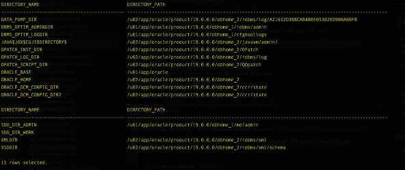
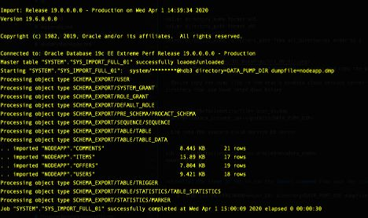

To **log issues**, click [here](https://github.com/oracle/learning-library/issues/new) to go to the github oracle repository issue submission form.

## Introduction

Oracle Data Pump offers very fast bulk data and metadata movement between user managed Oracle databases and Exadata Cloud Service Databaes.

Data Pump Import lets you import data from Data Pump files. You can save your data to either the database server or File Storage Server and use Oracle Data Pump to load data to Exadata Cloud Service Database.

This lab walks you through the steps to migrate a sample application schema using datapump import into your exadata cloud service database.


## Objectives

As a database admin or user,

1. Download a sample datapump export dump file from Oracle Learning Library github repository.
2. Secure copy the dump file to the exadata machine to the required directory and run import data pump


## Required Artifacts
- An Oracle Cloud Infrastructure account with privileges to create object storage buckets and dedicated autonomous databases.
- Access to a pre-provisioned Exadata cloud servicedatabase . Refer to [Lab 4](./ProvisionDatabase.md)
- A pre-provisioned instance of Oracle Developer Client image in an application subnet. Refer to [Lab 6](./ConfigureDevClient.md)

## Steps

### STEP 1: Download sample data pump export file from Oracle Learning Library github repo

- Log into your bastion server

```
<copy>
$ ssh -i <private_key> opc@<public_IP_address>
</copy>
```

```
```

- Create a folder on your bastion server as your user_number 

```
<copy>
cd dump_file
</copy>
```
```
<copy>
mkdir user_XX
</copy>
```
```
<copy>
cd user_XX
</copy>
```


- Use the following command in your folder on bastion server and download a sample schema dump from OLL

```
<copy>
wget -O user_01.dmp https://objectstorage.us-ashburn-1.oraclecloud.com/p/LdwVJ20TfCaQGHwH_fhi8xPRLZldM-QasPN2pjquak8/n/orasenatdpltintegration02/b/ExaCSScripts/o/data_pump_nodeapp.dmp
</copy>
```


### STEP 2: Setup environment to import data to Exadata Cloud Service Database 
- Log into your database from your bastion server and execute following command

```
<copy>
ssh -i </path/to/identity/file> oracle@<exadata_node>
</copy>
```
```
<copy>
source userXX
</copy>
```
```
<copy>
sqlplus system/<system_password>@usr_xx
</copy>
```

```
<copy>
set lines 500
column directory_name format a45
column directory_path format a95

select directory_name, directory_path from all_directories order by 1
/
</copy>
```


**NOTE**: Make sure directory ***DATA_PUMP_DIR*** exists and copy the path

- Secure copy the dump file to the oracle exadata cloud service server to the data pump directory that you have noted down before

```
<copy>
scp -i </path/to/identity/file> user_xx.dmp oracle@<Exadata_private_ip>:</path/to/DATA_PUMP_DIR>
</copy>
```

### STEP 3: Perform Data Import
- Log into the exadata cloud service DB server 

```
<copy>
ssh -i </path/to/identity/file> oracle@<exadata_node>
</copy>
```

```
<copy>
source userXX
</copy>
```

***NOTE:*** Login to Node of Exadata and make a TNS entry on your tnsnames.ora file such that your import data pump process only uses this particular node as we are placing the dump file on only one node and not on a shared file system.

```
<copy>
cd $ORACLE_HOME/network/admin/user_xx/
</copy>
```
```
<copy>
vi tnsnames.ora
</copy>
```

```
<copy>
usrxx_1 =
  (DESCRIPTION =
    (ADDRESS = (PROTOCOL = TCP)(HOST = <exa_node_1>.<subnet>.<vcn>.oraclevcn.com)(PORT = 1521))
    (CONNECT_DATA =
      (SERVER = DEDICATED)
      (SERVICE_NAME = usrxx..<subnet>.<vcn>.exavcn.oraclevcn.com)
      (FAILOVER_MODE =
        (TYPE = select)
        (METHOD = basic)
      )
    )
  )
</copy>
```

- Finally, the stage is set to run the import command from your dev client bash prompt

```
<copy>
IMPDP SYSTEM/<DB_PWD>@usrXX_1 DIRECTORY=DATA_PUMP_DIR DUMPFILE=user_XX.dmp CLUSTER=NO; 
</copy>
```

- In the above command, replace
  * __password__ - Admin password for your database system user
  * __usr_XX__ - The pluggable database that you created 
  * __directory__ - leave as shown above
  * __dumpfile__ -  The dump file that was secure copied to the directory location



**For more information on Oracle Data Pump, please refer to the [documentation](https://docs.oracle.com/en/database/oracle/oracle-database/19/sutil/oracle-data-pump.html#GUID-501A9908-BCC5-434C-8853-9A6096766B5A)**

All Done! Your application schema was successfully imported. 

You may now connect to your exadata cloud service database using a SQL client and validate import.

Congratulations! You have successfully completed migration of an Oracle database to the Exadata Cloud Service Database using Data Pump