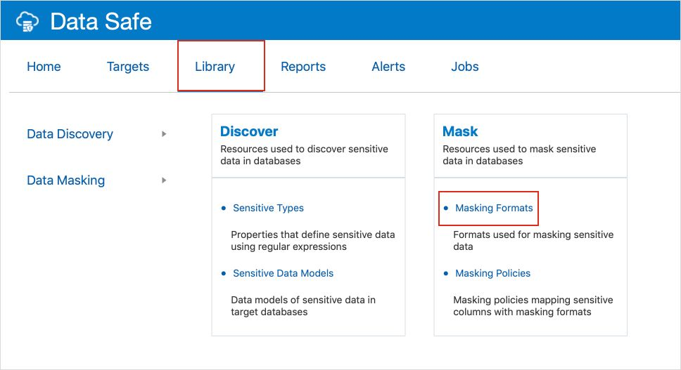
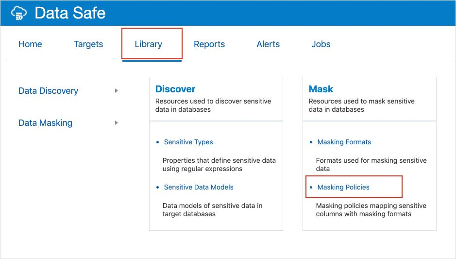
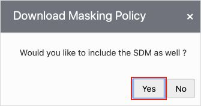

# Explore Data Masking Results and Reports in Oracle Data Safe

## Introduction
Using Data Safe, view masking formats and masking policies in the Library and analyze data masking results and reports.

To **log issues**, click [here](https://github.com/oracle/learning-library/issues/new) to go to the github oracle repository issue submission form.

## Objectives

In this lab, you learn how to do the following:
- View masking formats and masking policies in the Library
- Analyze data masking results and reports

## Challenge

Now that you have masked sensitive data in your target database, explore the masking components available in the Library as well as the masking components that get created by running a data masking job.

Follow these general steps:
1. Sign in to the Oracle Data Safe Console for your region.
2. Explore masking formats in the Library, and answer the following questions:
  - How many predefined masking formats exist in the Library?
  - Are there masking formats to mask columns like Employee ID and Department ID?
  - What is the range used in the Age masking format?
3. Explore masking policies in the Library, and answer the following questions:
  - Do you see the masking policy that you created in [Masking Lab 1 - Discover and Mask Sensitive Data by Using Default Masking Formats in Oracle Data Safe](?lab=lab-12-1-discover-mask-sensitive-data-by)
  - When was your masking policy last updated?
  - What details are shown when you open a masking policy?
4. Download your masking policy. You can use Notepad or TextEdit to open the XML file.
5. Explore the Data Masking report on the Reports tab.
6. Explore the Jobs page and answer the following questions:
  - Do you see the jobs that you ran?
  - How much time did the data discovery job take?
  - How much time did the data masking job take?

## Step-by-Step Instructions

### Step 1: Sign in to the Oracle Data Safe Console for your region

- From the navigation menu, click **Data Safe**

- You are taken to the **Registered Databases** Page.
- Click on **Service Console**

- You are taken to the Data Safe login page. Sign into Data Safe using your credentials.

### Step 2: Explore masking formats in the Library

- In the Oracle Data Safe Console, click the **Library** tab.
- Click **Masking Formats**.

- In the search box, enter **Employee** (case-sensitive) and press **Enter** or click the magnifying glass button. Do the same for **Department**. Notice that there are no matching masking formats listed for Employee.

- Clear the search field and press **Enter** to restore the list of masking formats.
- Click the **Age** masking format.
- Notice that there is a description and three examples. The description says `Replaces values with random numbers between 0 and 110`.
- Click **Close**.

### Step 3: Explore masking policies in the Library

- Click the **Library** tab.
- Click **Masking Policies**. Your masking policy that you created in [Masking Lab 1 - Discover and Mask Sensitive
Data by Using Default Masking Formats in Oracle Data Safe](DataSafeDM.md) should be listed (**<username> Mask1_HCM1**). The dates when the policy was created and last updated are displayed.
- Click your masking policy.

- Review the details, and then close the window.
- Notice that you can move the **Expand All** slider to the right to view all of the sensitive columns and their respective masking policies.
- Notice that you can click **Add** to add additional sensitive columns.
- Notice that you can upload pre/post masking scripts.
- To return to the **Masking Policies** page in the Library, click the browser's **Back** button.
  - If you click **Exit**, you are returned to the **Home** page.

### Step 4: Download your masking policy

- Go to the **Library tab** and click on **Masking Policies**.

- Select the check box for your masking policy.
- Click **Download**.

- The **Download Masking Policy** dialog box is displayed.
- Click Yes to download both the sensitive data model and the masking policy as a
combined template. Or, click **No** to download just the masking policy.
The XML file is downloaded to your browser.
A confirmation message is displayed on your page.

4. View your list of downloads in your browser and open the masking policy XML file.
5. Review the file, and then close it.

### Step 5: Explore the Data Masking report
1. Click the **Reports** tab.
2. On the left, click **Data Masking** and then again **Data Masking**.
3. Click your **Data Masking** report in the content pane to view it.

### Step 6: Explore the Jobs page
1. Click the **Jobs** tab.
  - The **Current and Past Jobs** tab shows you all of the jobs that you ran and are in the process of running.
  - The **Scheduled Job** tab shows you all of the jobs that are scheduled.
2. Examine the list of jobs on the **Current and Past Jobs** tab.
3. Position the cursor over the **Start Time** column heading, and then click the arrow to sort the column in descending order. This action shows you your latest jobs.
4. Find a recent data discovery job, and then view the **Elapsed Time** column. This column tells you how long the job took.
5. Click the data discovery job's ID to view all of its details.
6. Click the **X** button to close the dialog box.
7. Click a data masking job's ID to view all of its details.
8. Click the **X** button to close the dialog box.

### All Done!
