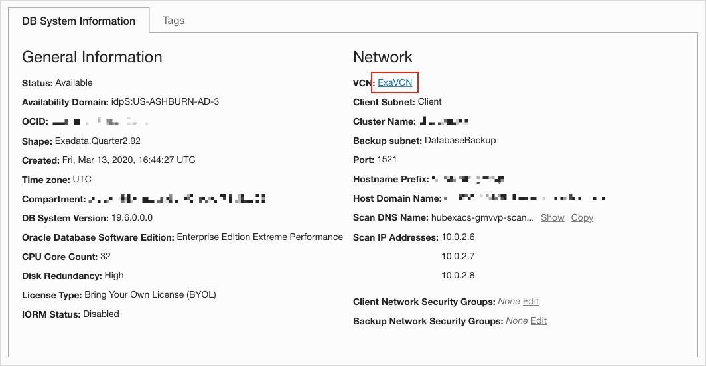
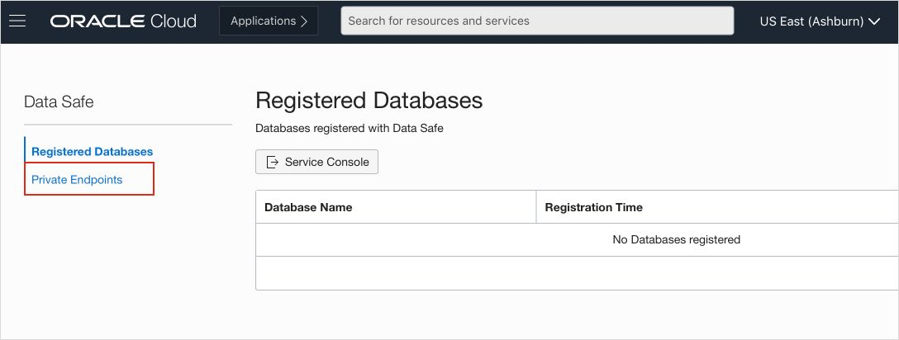
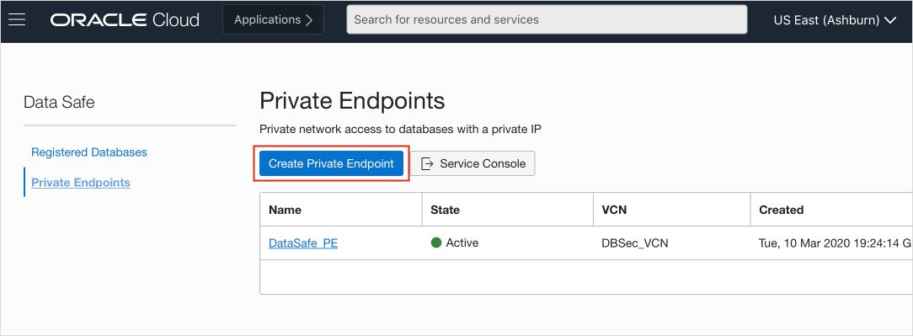
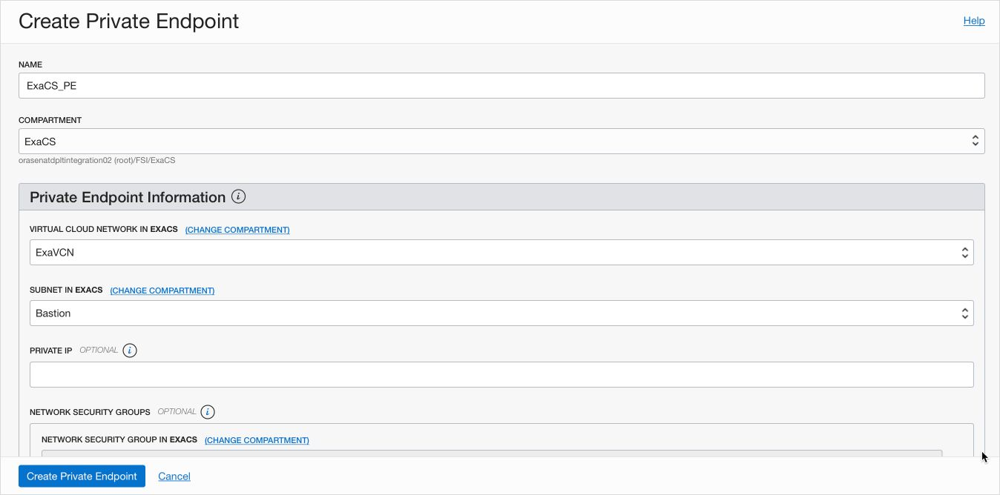
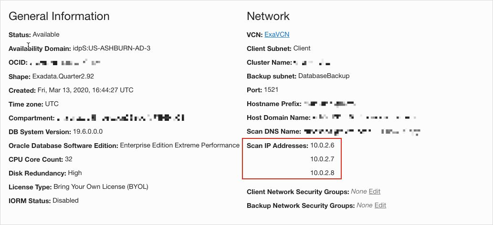
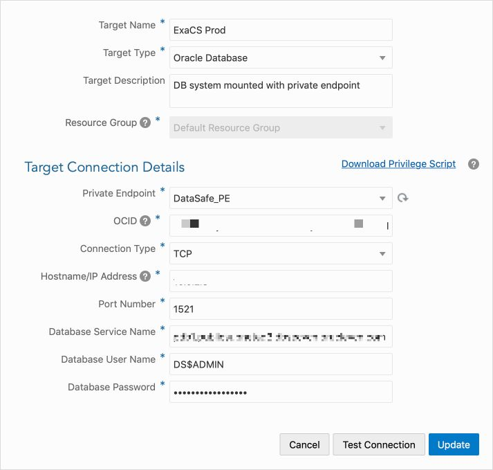

<table class="tbl-heading"><tr><td class="td-logo">


March 25, 2020
</td><td class="td-banner">
# Register a Target Database that has a Private IP Address
</td></tr><table>

## Introduction
Oracle Data Safe can connect to an Oracle Cloud database that has a public or private IP address on a virtual cloud network (VCN) in Oracle Cloud Infrastructure (OCI). This workshop describes the difference between public and private endpoints and explains the network connection between Oracle Data Safe and the databases. It also walks you through the steps of creating a private endpoint and registering a Exadata Cloud DB system with Oracle Data Safe when the DB system has a private IP address.

## Requirements
The following diagram illustrates the network connections between Oracle Data Safe and a DB system (VM, BM, or Exadata) and an Autonomous Database (ATP-D, ATP-S, or ADW) that have private IP addresses.

## Create a Private Endpoint
If your DB system has a private IP address, you need to create a private endpoint for it prior to registering it with Oracle Data Safe. You can create private endpoints on the Data Safe page in OCI. Be sure to create the private endpoint in the same tenancy and VCN as your database. The private IP address does not need to be on the same subnet as your database, although, it does need to be on a subnet that can communicate with the database. You can create a maximum of one private endpoint per VCN.


- From your database's Console in OCI, obtain the name of the virtual cloud network (VCN) on which your database resides. You can find the name on the DB System Information tab.



- From the navigation menu in OCI, select **DataSafe**. The **Data Safe** page is displayed.


- On the left click **Private Endpoint**. The **Private Endpoint** is displayed.



- Click **Create Private Endpoint**. The **Create Private Endpoint** page is displayed.



- In the **Name** field, enter the name of your private endpoint.
- Select the compartment in which you want to store the private endpoint.
- Scroll down to the **Private Endpoint Information** section.
- From the **VIRTUAL CLOUD NETWORK** drop-down list,select your database's VCN. If needed, click **CHANGE COMPARTMENT** and select the compartment that stores your VCN. You can select a different VCN than your database's VCN if VCN peering is set up between your database's VCN and the VCN that you select here.
- From the SUBNET drop-down list, select a subnet within the selected VCN. If needed, click **CHANGE COMPARTMENT** and select the compartment that stores the subnet that you want to use. The subnet can be in a different compartment than the VCN. The subnet that you select needs to have access to the database's subnet.
- (Optional) In the **PRIVATE IP** field, specify a private IP address. If you do not specify a private IP address, OCI automatically generates one for you in the selected subnet.
- (Optional)Select a network security group. The following screenshot shows you an example configuration for a private endpoint:



- Click **Create Private Endpoint.**
A private endpoint is provisioned in the customer VCN (the VCN that you selected). The following screenshot shows you the private endpoint listed on the **Private Endpoints** page.


## Update the Related Security List and Network Security Group

After creating the private endpoint and before registering the DB system with Oracle Data Safe, you need to update the related security list and network security group (if implemented) for your database VCN to allow traffic from the private endpoint IP address to the DB system. This step is required so that Oracle Data Safe can connect to your DB system. The following diagram illustrates an example of how to configure a security list.

- **Ingress for the database:** The database (on port 1521) can receive incoming traffic from the private endpoint's private IP address (from any port).


- **Egress for the private endpoint:** The private endpoint (from any port) can send requests to the database IP address (on port 1521).


## Register a ExaCS DB using a Private IP

You can manually register DB systems (with public or private IP addresses) with Oracle Data Safe in the Oracle Data Safe Console. When you register a DB system with a private IP address, you are required to select a private endpoint and enter the database's private IP address and Oracle Cloud Identifier (OCID).

- From the database's Console in OCI, obtain the private IP address for the database. For an Exadata DB system, Oracle recommends that you use one of the scan IP addresses. You can find a scan IP address under Network on the DB System Information tab, as shown below.



- Sign in to the Oracle Data Safe Console.
- Click the **Targets** tab.
- Click **Register.** The **Register Target** dialog box is displayed.


- Specify a name for your target database.
- For **Target Type**, select **Oracle Database**.
- (Optional) Enter a description for your target database.
- Select the resource group to which you want your target database to belong. Alternatively, you can specify a new resource group.
- For **Database with PrivateIP**, select **Yes**.
- For **Private Endpoint**, select the name of the private endpoint that you created for your target database.
- In the **OCID** field, enter the Oracle Cloud Identifier of your database system. You cannot use the OCID of the database or PDB.
- For the connection type, select **TCP** or **TLS**. The default selection is TCP.
- In the **Hostname/IP Address** field, enter the private IP address for your database. For an Exadata DB system, Oracle recommends that you enter one of the private scan IP addresses. Alternatively, you can enter the private floating IP address of any one of the database nodes.
- Enter the port number for the database.
- Enter the long version of the database service name for the target database; for example, **abc_prod.subnetad3.tttvcn.companyvcn.com**. For Virtual Machine, Bare Metal, and Exadata DB systems, you can find the service name by running the following statement when connected to the PDB via SQL Plus:

```
select sys_context('userenv','service_name') from dual;
```
> **Note:** For Virtual Machine and Bare Metal DB systems, you can also find the name in the database's Console in OCI.

- Enter the database username and password that you created on the target database specifically for Oracle Data Safe. If you created the user on the target database without quotation marks, you must enter the user name in uppercase here. For example, if the user name on the target database is called test, then you must enter TEST.
You cannot specify database roles, such as SYSDBA or SYSKM, and you cannot specify SYS as the user.
- (Optional)To verify that Oracle Data Safe can successfully connect to the target database, click Test Connection.
- Before you register the target, click **Download Privilege Script** and save the dscs_privileges.sql script to your computer. You need to run this script on your database after you are done with registration.
- Click **Register Target**. You cannot register the target database if the connection test fails or if the target database does not exist.



- Grant privileges to the database user that you created for Data Safe using the privilege script you downloaded in step 19. See [Grant Roles to the Oracle Data Safe Service Account on a DB System](https://docs.oracle.com/en/cloud/paas/data-safe/udscs/grant-roles-oracle-data-safe-service-account-db-system.html).


<table><tr>
<td class="td-logo">

[](#)

</td>
<td class="td-banner">
### All Done!
</td></tr><table>
