## Introduction

This lab walks you through the steps to get started using Installing Enterprise Manager on ExaCS on Oracle Cloud Infrastructure. 

To log issues and view the Lab Guide source, go to the [github oracle](https://github.com/oracle/learning-library/issues/new) repository.

## Requirements
- To install Enterprise Manager Marketplace Image on a Private IP:
    - Followed Steps in the Networking Lab for setting up an app subnet in your ExaCS compartment
- Have a preexisting EM with Fast Connect to connect to OCI infrastructure


## Sections
- Deploy Enterprise Manager Marketplace Image
- Install Agents
- View monitoring details/ set alerts


### Deploying Enterprise Manager Marketplace Image

#### Setting Up Policies/Pre-reqs
- Reference the [documentation](https://blogs.oracle.com/oem/oracle-enterprise-manager-is-now-available-on-oracle-cloud-marketplace) here to help set up your EM markeplace Image.
- The following steps must be done by an OCI ADMIN
- We assume you already have a Exa compartment setup.
- Navigate to that compartment and copy the compartment OCID


- Now navigate to dynamic groups

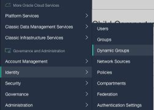

- Press Create Dynamic Group
- Give a name such as OEM_GROUP, description and optionally a tag

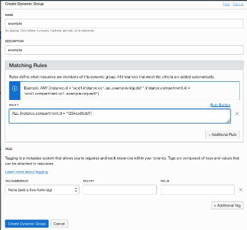

- In the Matching Rules section, insert

```
<copy>
ALL {instance.compartment.id = '<compartment ocid>'}
</copy>
```

- Press Create Dynamic Group
- Now, navigate to policies


- Under List scope, change compartment to root

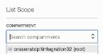

- Press Create Policy

- Enter a name such as OEM_Policy and an optional description

- Then give these two Policy Statements to the group you created earlier.

```
<copy>
Allow dynamic-group OEM_Group to manage instancefamily in tenancy
</copy>
```

```
<copy>
Allow dynamic-group OEM_Group to manage volumefamily in tenancy
</copy>
```

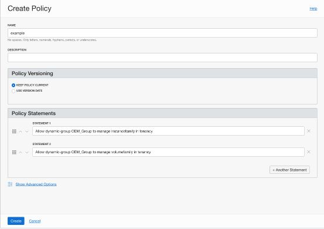

- Press Create Policy

- Lastly, you need to make sure these ports are open in your app subnet in your EXACS VPN (see networking lab for reference)

| Destination Port Range |	Protocol Type |	Service |
|------------------------|----------------|---------|
|22    |  TCP |	SSH
|7803 |	TCP |	Console
|4903 |	TCP |	Agent Upload
|7301 |	TCP |	JVMD
|9851 |	TCP |	BIP

#### Provision Marketplace Image
- Navigate to OCI Marketplace

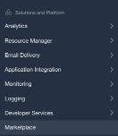

- Select the EM image in the OCI Marketplace.  From the OCI Main Menu, Click on the Marketplace.  Search for Oracle Enterprise Manager 13.3 and Click on it.

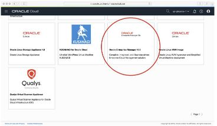

- Review the Oracle Enterprise Manager Overview and Click on Launch Instance


- Select the Package Version, specify your OCI Compartment name, Accept the Terms of Use and click Launch Instance

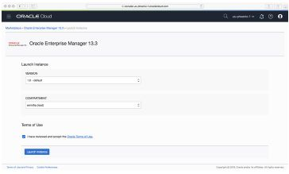

- Create an Instance Name, select your desired OCI Availability Domain and Select the desired shape for VM. You can choose any shape that is available.

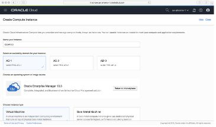

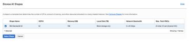

- Enter the ssh public key that will be used to access the instance as well as the Virtual Cloud Network and Subnet created in the prerequisites, and then Click on Create!  

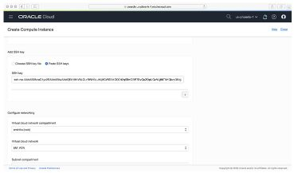

- Now you can go get some coffee while the Image is installed in your OCI compartment.  The installation takes approximately 30 minutes of elapsed time.

### Logging into Image

- Once your VM instance is running, Click on the instance and copy the Public IP Address.  SSH to the VM instance with the ssh key

```
<copy>
</copy>
```

```
$ ssh –i <private_ssh_key> opc@<public_IP_Address>
```

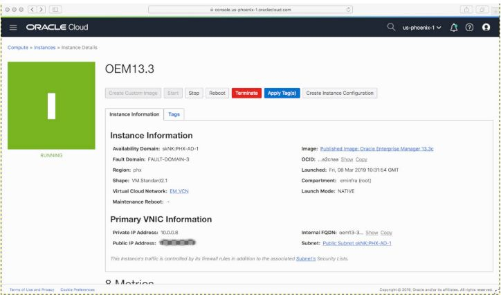

- Check the status of your newly-installed EM:  In the command line console, change your user to ‘oracle’ user by executing below in the command and then Check the OMS status using the EMCLI.

```
<copy>
$ sudo su – oracle
</copy>
```

```
<copy>
$ /u01/app/em13c/middleware/bin/emctl status oms
</copy>
```

- Sample status:

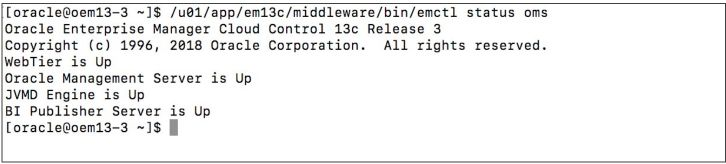

- Change default passwords.  The password for the EM user sysman, EM Agent, Registration Password, Fusion Middleware user weblogic and Node Manager can be accessed in the below file (access as root user)"

```
<copy>
$ cat /root/.oem/.sysman.pwd 
</copy>
```

```
<copy>
$ /u01/app/em13c/middleware/bin/emctl config oms -change_repos_pwd
</copy>
```

- Log in to your new EM Console

```
<copy>
https://<public_ip_address>:7803/em
</copy>
```

#### Troubleshooting

Installation log is located at:

```
<copy>
cat /var/log/emcg_setup.log
</copy>
```

Refer to this [doc](https://blogs.oracle.com/oem/enterprise-manager-on-oci-installation-phase-2-installing-the-em-app-into-your-oci-compartment) for more help.


### Install Agents
#### Set up Credentials in Enterprise Manager
- Login in to your Enterprise Manager

- Go to Setup->Security-Named Credentials


- Click Create

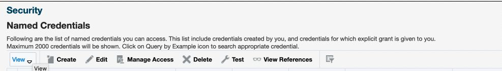

- Fill in Fields (Give Credential Name 'ExaCS1), Select SSH Credentials under Credential Type. Select Scope: Global

- Upload SSH Private Key. UserName should be Oracle

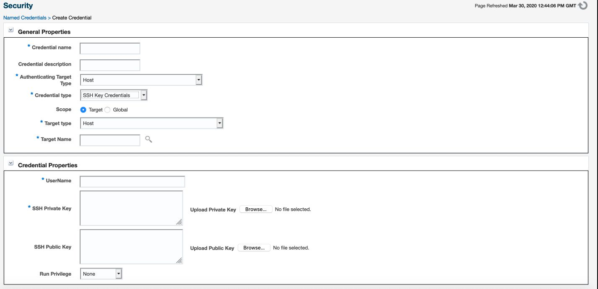

#### Add host target manually

- Select Add Target manually Setup->Add Target->Add Targets Manually


- Select 'Install Agent on Host'

- Press 'Add'

- If you have added the ExaCS node IP addresses to your hosts file, enter the Full Qualified Domain Name you have entered there, else enter the IP address

- Platform: Select Linux x86-64

- Add as many nodes as are on the ExaCS (Quarter Rack=2, Half=4, etc....)

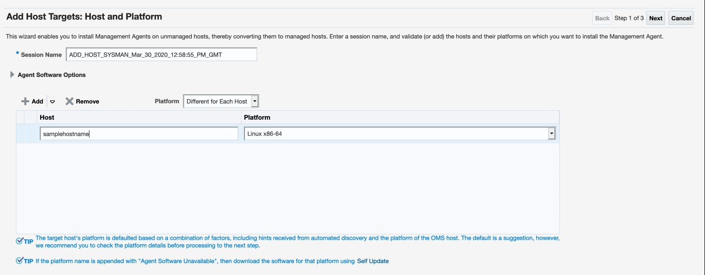

- Click Next, then select your Named Credential and specify a install directory that your user in your named credentials file has access to.

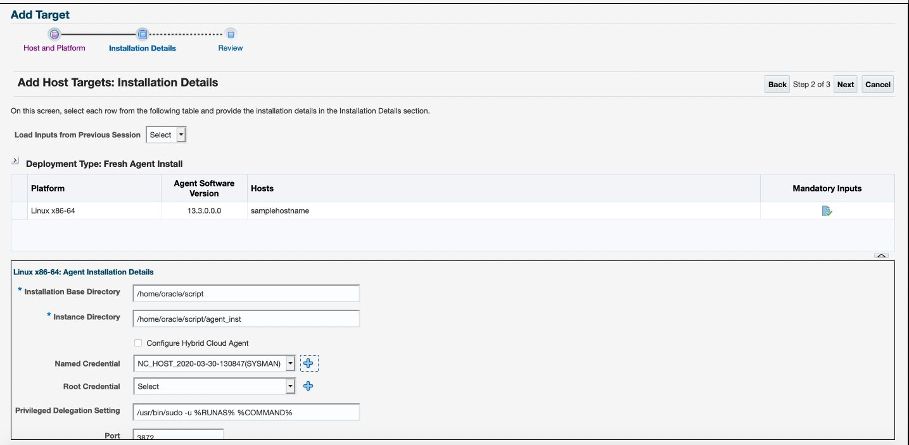

- Click Next, after reviewing click 'Deploy Agent'

- If there are errors, you need to make changes to your credentials or installation details page.

#### Add Non-Host Targets Using Guided Process
- Setup-> Add Target-> Configure Auto Discovery

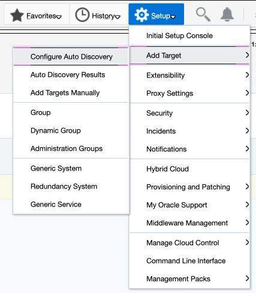

- Select 'Targets on Hosts'


- Select your hosts, one at a time!

- Select 'Discover Now'

- Select your next host and repeat until all nodes have been discovered

- Now navigate to Auto Discovery Results

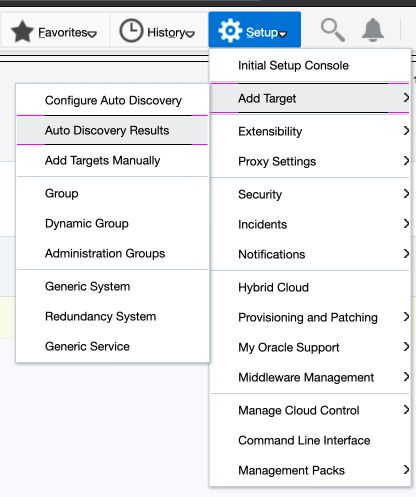

- You now need to find the 'cluster' Target and promote it. 

- No Cluster database target can be added/promoted/discovered until the 'cluster' target has been added or discovered. Promote it with its default inputs.

- After promoting the 'cluster' Target, promote the 'Cluster Database' target by finding one and clicking promote. Promoting the Cluster DB should also promote its DB instances.

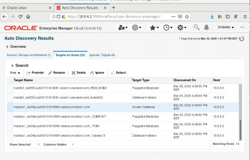

- You will need to enter a monitoring user credentials (like dbnsmp) for this cluster. You can also enter the SYSDBA Password.

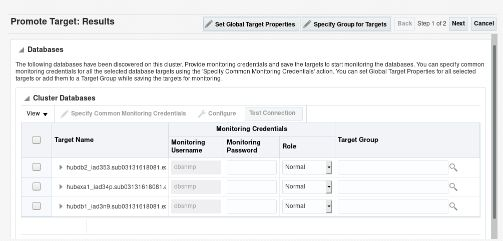

- If you have selected multiple databases and you want to set the same monitoring properties for all of them, select Specify Common Monitoring Credentials. Enter the monitoring credentials, monitoring password, and role. Click Apply.

- Click Next, review and then click Save.

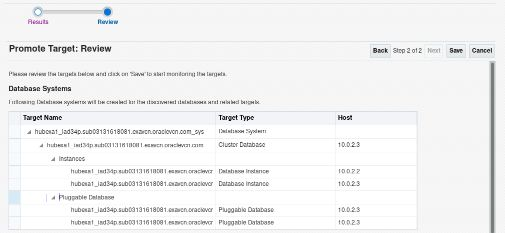

- For additional documentation see: https://docs.oracle.com/cd/E63000_01/EMADM/discovery_db.htm#EMADM13664

- Repeat this process for all Cluster Databases. Promote any additional targets you want to monitor.

- You can review by going to the 'Configure Auto Discovery' to see what has been promoted.

### View monitoring details/set alerts

- To View an Enterprise Summary of all targets, go to Enterprise->Summary


- In Enterprise Summary you can view status of all targets, with the availability to sort by different types.

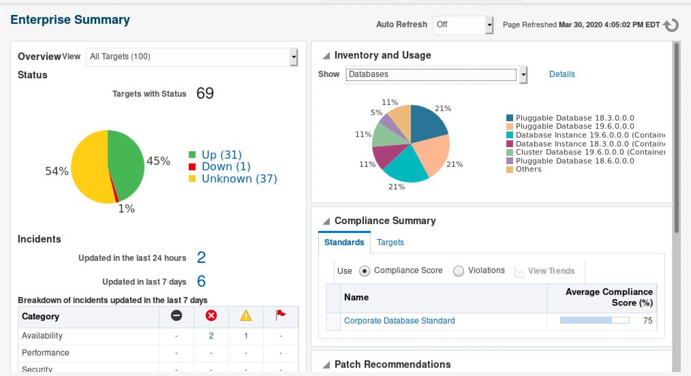

#### Creating Groups

- To create a group, navigate to Targets->Groups. We will create a dynamic group that includes everything on our Exadata Cloud Service hosts.


- Once there press Create Group->Dynamic Group

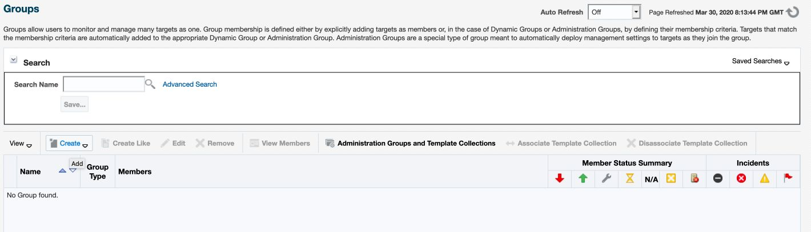

- Give it a name (for example ExaCS)

- Press Define Membership Criteria


- Press the search bar next to 'On Host'


- Move over all nodes(hosts) from the ExaCS and Press Select


- Then Press OK and OK again to create Group.

#### Viewing Monitoring Details

- To navigate to targets, press the targets dropdown, then select All Targets


- Search for a target you want to see metrics for, for example a db name

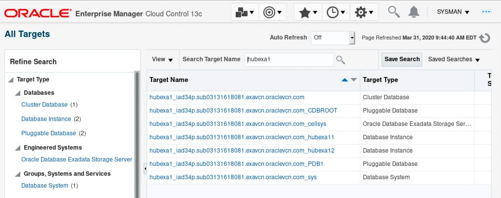

- Select the Cluster Database

- This will take you to main target page for the database. TO see all metrics, select Cluster Database-> Monitoring ->All Metrics


- Here you can search and explore for different metrics on the cluster level.


- To view metrics navigate to Members->Dashboard


- Here you can select a database instance and repeat the process to see metrics for an instance.

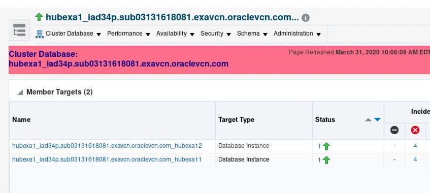

All Done! Your EM is successfully installed and setup to monitor activity ! 


Congratulations! You have successfully completed setting up of EM for an Exadata Cloud Service Database