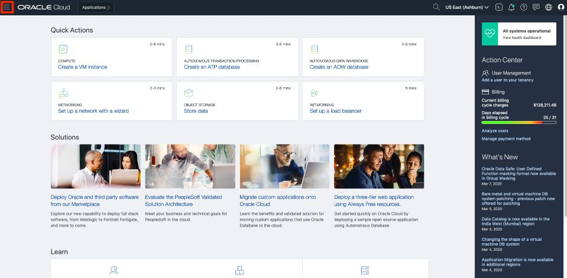
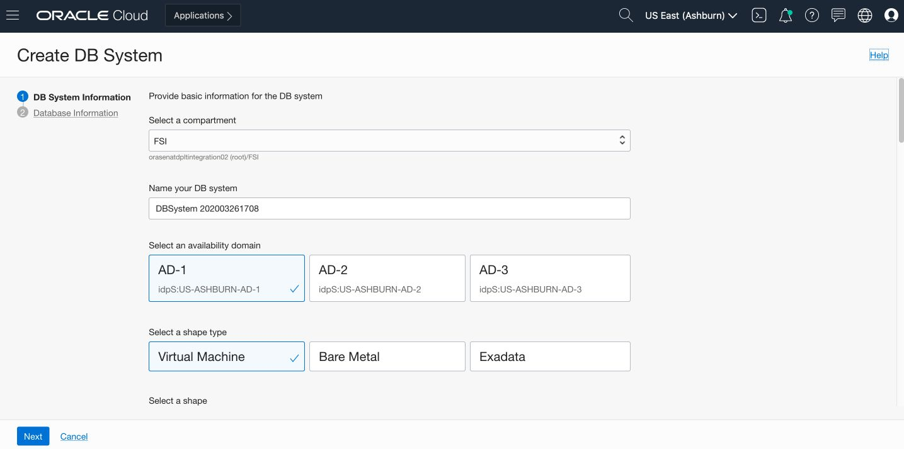
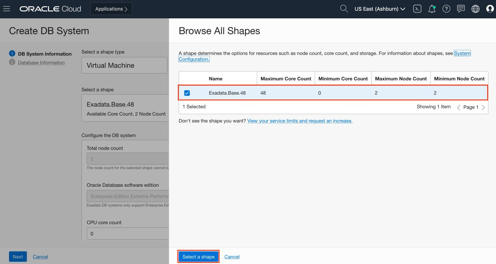
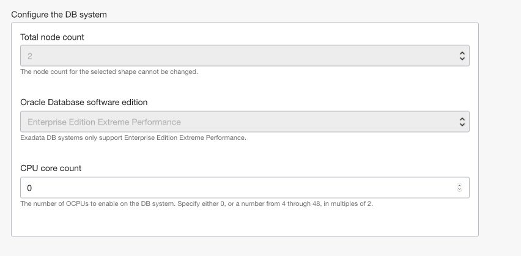
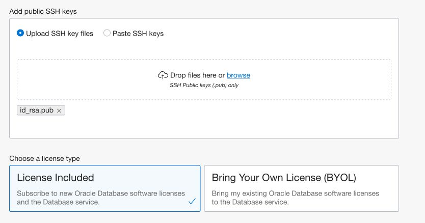
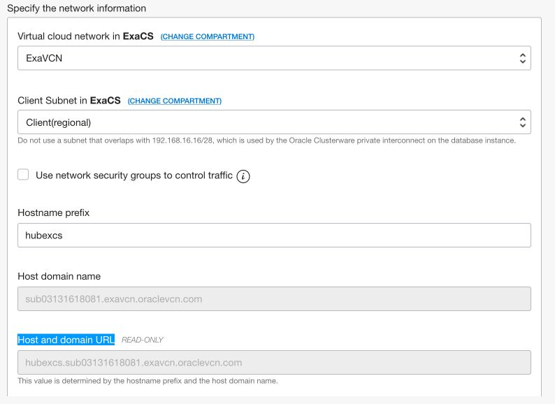
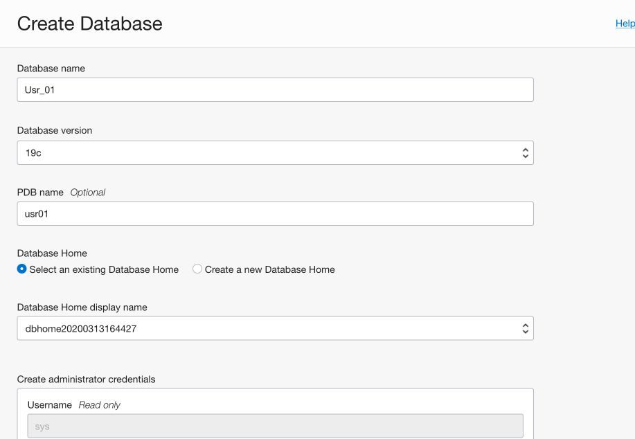
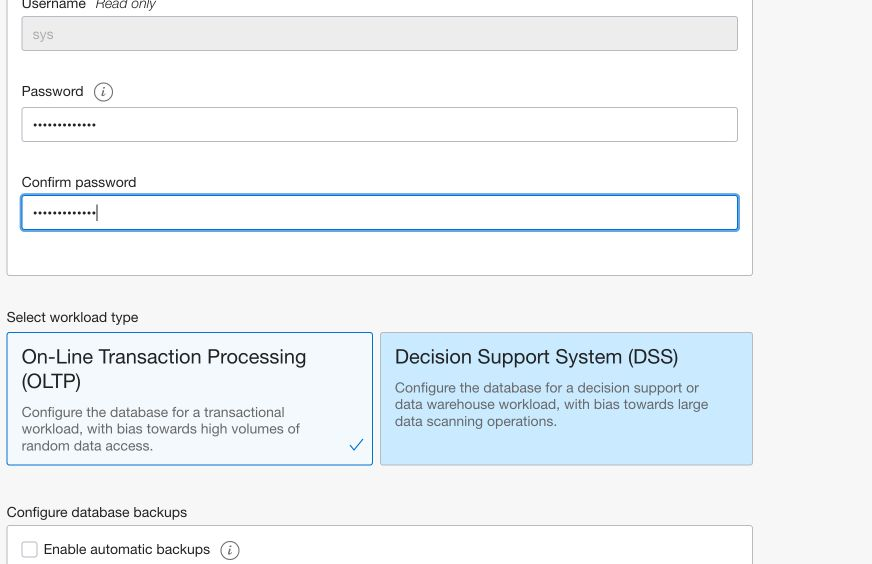
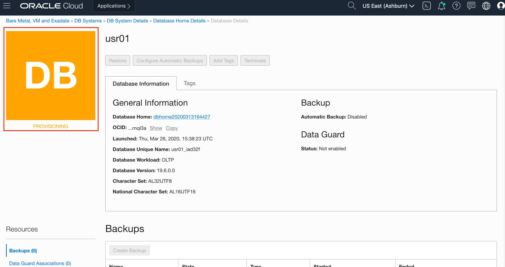

## Introduction

This lab walks you through the steps to get started using the Oracle Exadata Cloud Service Infrastructure. You will provision a new database infrastructure.

To log issues and view the Lab Guide source, go to the [github oracle](https://github.com/oracle/learning-library/issues/new) repository.

## Objectives

As a database user or DBA, 

- Rapidly deploy Exadata Infrastructure in a pre-provisioned private network in your OCI account 

## Required Artifacts

- An Oracle Cloud Infrastructure account with service limits to deploy at least one 1/4 rack of Exadata Infrastructure in any one region or Availability Domain.
You also need privileges to create Exadata Infrastructure 

# Provisioning an Exadata Cloud Service Database Instance

In this section you will be provisioning a database using the cloud console.
## Steps

### STEP 1: Create an Exadata Cloud Service Infrastructure 

**Login to your OCI account as a database user**

-  Click on the hamburger menu icon on the top left of the screen



-  Click on **Bare Metal, VM, and Exadata** from the menu


- Select **ExaCS Compartment** 


**Note:** Oracle Cloud Infrastructure allows logical isolation of users within a tenancy through Compartments. This allows multiple users and business units to share an OCI tenancy while being isolated from each other.

**If you have chosen the compartment you do not have privileges on, such as a root compartment, you will not be able to provision a Database instance in it.**

More information about Compartments and Policies is provided in the OCI Identity and Access Management documentation [here](https://docs.cloud.oracle.com/iaas/Content/Identity/Tasks/managingcompartments.htm?tocpath=Services%7CIAM%7C_____13).

-  Click on **Create DB System** that is created


- Upon clicking a pop-up will appear that will enable you to create exadata infrastructure. Fill in the section 1, DB System Information details as shown below 




- Select a compartment : <Your working compartment>
- Name your DB system : <DB Display Name >
- Select an availability domain : <AD1, AD2, AD3>


- Select a shape type : Exadata
- You can select required shape from the pop-up based on your availability




- Configure the DB system
    - Total node count : 2
    - Oracle Database software edition : Enterprise Edition Extreme Performance
    - CPU core count : <Min 4 upto 48>


- Configure storage (Optional)
- Add public SSH keys : <Add public key>
- Choose a license type : <License Included>



- Specify the network information
    - Virtual cloud network in ExaCS : ExaVCN
    - Client Subnet in ExaCS : Client(regional)
    - Hostname prefix : <your hostname prefix>
    - Host domain name : read-only 
    - Host and domain URL : read-only



- After clicking **Next**, fill in the details for Database Information as shown below

```
Database name : usrXX
Database version : 19c
PDB Name : usr_XX
Database Home : Select an existing Database Home
Database Home display name : User-XX-db
Create administrator credentials 
    - Password : create password 
Select workload type:
    - On-Line Transaction Processing (Choose this)
    - Decision Support System (DSS)
Configure database backups : do not check this
```




 ****NOTE: Password must be 9 to 30 characters and contain at least 2 uppercase, 2 lowercase, 2 special, and 2 numeric characters. The special characters must be _, #, or -.**** 

#### For this lab, we will be using the following as password

```
WE#lcome_1234
```
- After filling all the required details, click on **Create Database**  


- Your Exadata cloud service database instance should be up and running in a few minutes.

All Done! You have successfully deployed your Exadata cloud service infrastructure and created a database instance and it should be ready for use.