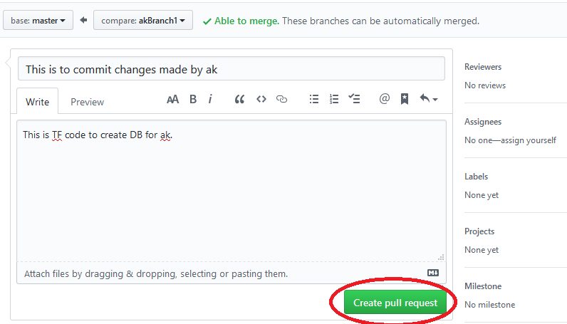
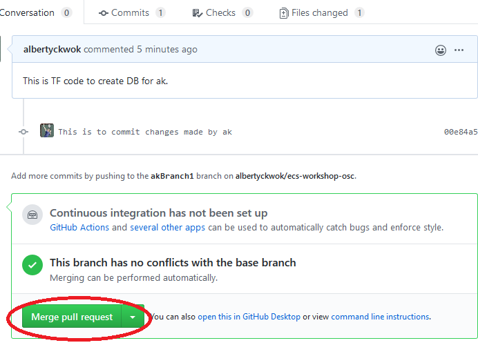
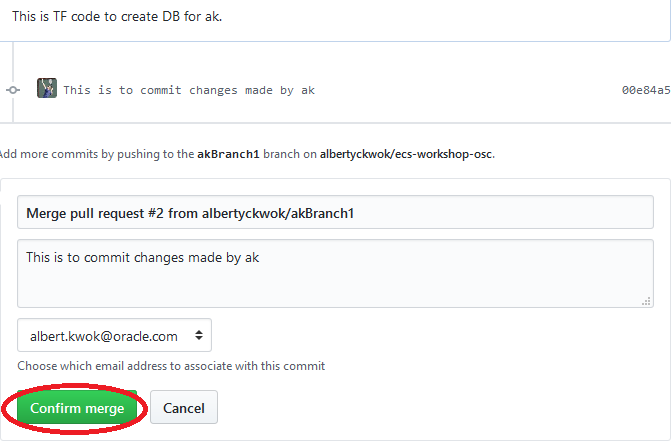
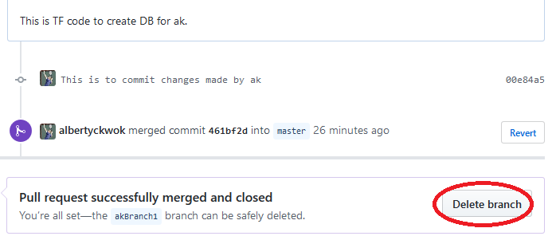

# Manage database with Terraform

Terraform enables you to safely and predictably create, change, and improve infrastructure. It is an open source tool that codifies APIs into declarative configuration files that can be shared amongst team members, treated as code, edited, reviewed, and versioned.

During the privious lab using Console/UI to manage database and VM Cluster manually, you are most likely has made some mistake, selecting the wrong link, clicking on the wrong button, couldn't find what you wanted, etc. Terraform provides a much better way to maintain a stable, scale-able, manageable, etc environment that minimimize down time due to human errors.

In this lab you will practice the following:

* [Create database](#create-database)
* [Add database](#add-database)
* [Delete database](#delete-database)

## Create database

In this exercise, you will be creating a database using follow Terraform code template.
<br>
```
variable "xx_db_count" {
  description = "Number of database created by xx"
}
resource "oci_database_database" "xx_database" {
  count = var.xx_db_count
  #Required
  database {
    admin_password = "BEstr0ng--${count.index}"
    db_name        = "xxDb${count.index}"
    character_set  = "AL32UTF8"
    ncharacter_set = "AL16UTF16"
    db_workload    = "OLTP"
    pdb_name       = "xxPdb${count.index}"

    db_backup_config {
      auto_backup_enabled = false
    }
  }
  //It takes about 40 min to create 1 DB so make it simple to give an hour per DB
  timeouts {
      create = "${var.db_count}h"
 }

  db_home_id = oci_database_db_home.tf_db_home.id
  source     = "NONE"
}
```

### Tasks:

As mention before, we will use simple GitHub workflow to show how to develop and operation infrastruture specifically database in this case.

#### Task 1: Create a branch

When you're working on a project, you're going to have a bunch of different features or ideas in progress at any given time – some of which are ready to go, and others which are not. Branching exists to help you manage this workflow.

When you create a branch in your project, you're creating an environment where you can try out new ideas. Changes you make on a branch don't affect the `master` branch, so you're free to experiment and commit changes, safe in the knowledge that your branch won't be merged until it's ready to be reviewed by someone you're collaborating with.

To create a branch on the repository that you clone/copy from previous lab, you run [`git checkout -b <my branch name>`](http://git-scm.com/docs/git-checkout) in the directory where you clone the repository.

```
myInitial=\<your initial>
cd ~/ecs-workshop-osc
git checkout -b ${myInitial}Branch1
```
The following is the sample output for the above commands:
```
akwok@DESKTOP-7JNMR77 MSYS ~/ecs-workshop-osc (master)
$ myInitial=ak

akwok@DESKTOP-7JNMR77 MSYS ~/ecs-workshop-osc (master)
$ git checkout -b ${myInitial}Branch1
Switched to a new branch 'akBranch1'

```
#### Task 2: Do your work independently

1. Use your favor editor, such as VS code IDE, vi, gedit, etc to create/edit a terraform config file by copy/paste the above terraform code template or using command line sed editor as follow:
    * myInitial=\<your initial>
    * cd ~/ecs-workshop-osc
    * sed -e "s/xx/$myInitial/g" > ${myInitial}DB.tf
    * Copy/paste the above terraform code template then ctrl-D to exit sed.
2. Run the following to intialize terraform. Note: you only need to run it once and someone else, likely the OSC lead engineer has run it before but it doesn't hurt to run it multiple times.
    * terraform init
3. The following command will show what terraform will do:
    * terraform plan
    * You may need to edit your terraform code ${myInitial}DB.tf to fix any error and feel free to changes other config too and re-run the above command. As with all terraform commands, they are idompodent, namely, you can run it many times and the state of the environment will not change, i.e. remain the same, till you change the code and apply it.
4. If the above command check out OK, i.e. what it plan to do is exactly what you want, then you can run the following apply command to execute the plan. Or your company is likely to have a formal DevOps process/workflow to ensure a stable environment that requires you to go through a review process before applying the changes. The following lab will show an example of DevOps workflow for this purpose.
    * nohup terraform apply -auto-approve -no-color & sleep 3; tail -f nohup.out
    * **Note**: we need to use nohup to ensure the terraform will continue to execute in case there is network problem that disconnect your terminal session.

#### Task 3: Add commits

Once your branch has been created, it's time to start making changes. Whenever you add, edit, or delete a file, you're making a commit, and adding them to your branch. This process of adding commits keeps track of your progress as you work on a feature branch.

Commits also create a transparent history of your work that others can follow to understand what you've done and why. Each commit has an associated commit message, which is a description explaining why a particular change was made. Furthermore, each commit is considered a separate unit of change. This lets you roll back changes if a bug is found, or if you decide to head in a different direction.

To add a file to a commit, you first need to add it to the staging environment. To do this, you can use the <b>[git add](http://git-scm.com/docs/git-add)&nbsp;\<filename></filename></b> command (see Step 3 below).

Once you've used the git add command to add all the files you want to the staging environment, you can then tell git to package them into a commit using the [**git commit** ](http://git-scm.com/docs/git-commit)command.

The following are the commands that you need to execute:

```
myInitial=ak
git add ${myInitial}DB.tf
git commit -m "This is to commit changes made by ${myInitial}"
```
The following is the sample output for the above commands:
```
akwok@DESKTOP-7JNMR77 MSYS ~/ecs-workshop-osc (akBranch1)
$ git add ${myInitial}DB.tf

akwok@DESKTOP-7JNMR77 MSYS ~/ecs-workshop-osc (akBranch1)
$ git commit -m "This is to commit changes made by ${myInitial}"
[akBranch1 00e84a5] This is to commit changes made by ak
 1 file changed, 0 insertions(+), 0 deletions(-)
 create mode 100644 akDB.tf

```

#### Task 3: Publish your work

Once you are happy with your work. You will **push** the commit in your branch to your new GitHub repo. This allows other people to see the changes you've made. If they're approved by the repository's owner, the changes can then be merged into the master branch.

To push changes onto a new branch on GitHub, you'll want to run `**[git push](http://git-scm.com/docs/git-push) origin yourbranchname**.`GitHub will automatically create the branch for you on the remote repository:

```
git push origin ${myInitial}Branch1
```
The following is the sample output for the above commands:
```
akwok@DESKTOP-7JNMR77 MSYS ~/ecs-workshop-osc (akBranch1)
$ git push origin ${myInitial}Branch1
Enumerating objects: 4, done.
Counting objects: 100% (4/4), done.
Delta compression using up to 8 threads
Compressing objects: 100% (2/2), done.
Writing objects: 100% (3/3), 285 bytes | 285.00 KiB/s, done.
Total 3 (delta 1), reused 0 (delta 0)
remote: Resolving deltas: 100% (1/1), completed with 1 local object.
remote:
remote: Create a pull request for 'akBranch1' on GitHub by visiting:
remote:      https://github.com/albertyckwok/ecs-workshop-osc/pull/new/akBranch1
remote:
To github.com:albertyckwok/ecs-workshop-osc.git
 * [new branch]      akBranch1 -> akBranch1

```

You might be wondering what that "origin" word means in the command above. What happens is that when you clone a remote repository to your local machine, git creates an **alias** for you. In nearly all cases this alias is called "[**origin**](https://git-scm.com/book/en/v2/Git-Basics-Working-with-Remotes)." It's essentially shorthand for the remote repository's URL. So, to push your changes to the remote repository, you could've used either the command: <b>`git push [git@github.com](mailto:git@github.com):git/git.git yourbranchname`</b> or <b>`git push origin yourbranchname`</b>

#### Task 4: Open a Pull Request

Pull Requests initiate discussion about your commits. Because they're tightly integrated with the underlying Git repository, anyone can see exactly what changes would be merged if they accept your request.

You can open a Pull Request at any point during the development process: when you have little or no code but want to share some screenshots or general ideas, when you're stuck and need help or advice, or when you're ready for someone to review your work. By using GitHub's @mention system in your Pull Request message, you can ask for feedback from specific people or teams, whether they're down the hall or ten time zones away.

* Browser to the project URL, it should look something like the following. Please ask the instructor if you don't have it.
    * https://github.com/albertyckwok/ecs-workshop-osc
* Login to GitHub.
* Click the ‘Pull requests’ tab..
* Click ‘Compare and pull request’ button for your branch, e.g. akBranch1.
* Write something, e.g. "This is TF code to create DB for xx".
* Click “Create pull request”.

#### Task 5: Merge your work with others

Once merged, Pull Requests preserve a record of the historical changes to your code. Because they're searchable, they let anyone go back in time to understand why and how a decision was made.
<br>
* Browser to the project URL, it should look something like the following. Please ask the instructor if you don't have it.
    * [https://github.com/albertyckwok/ecs-workshop-osc](https://github.com/albertyckwok/ecs-workshop-osc)
* Login to GitHub.
* Click the ‘Pull requests’ tab.
* Click on “Merge pull request” to merge the changes into master branch.
* Click “Confirm merge”.
* You can delete the branch once all the changes have been incorporated and if there are no conflicts. 

## Add database

Once you have the basic terraform config is setup, add database can be easily accomplished by chaning the config or adding more config file.

### Tasks:

1. To create/add more database of the same type, you can simply update the statement count says from **2** in bold above to 3, the run terraform plan and apply.
2. To create other type of database, e.g. db version 19, you can copy/paste the same code block and update the statement to `db_version   = "19.0.0.0"`.

## Delete database

Similar to adding database, you can update the config by reduce the count of database or deleting the file all together, then run plan and apply to delete the database that you don't want.
**Note**: most companies will want to take great care in delete database as data/information is the bread and butter of their business thus you will likely need to go through some formal process/workflow such as the DevOps exercise in the next lab.