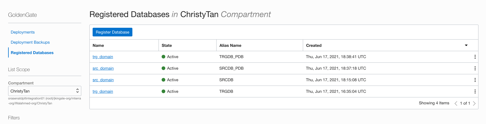
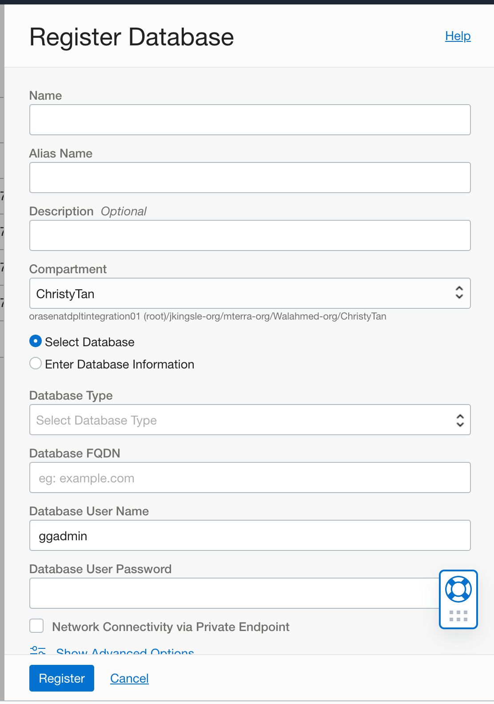
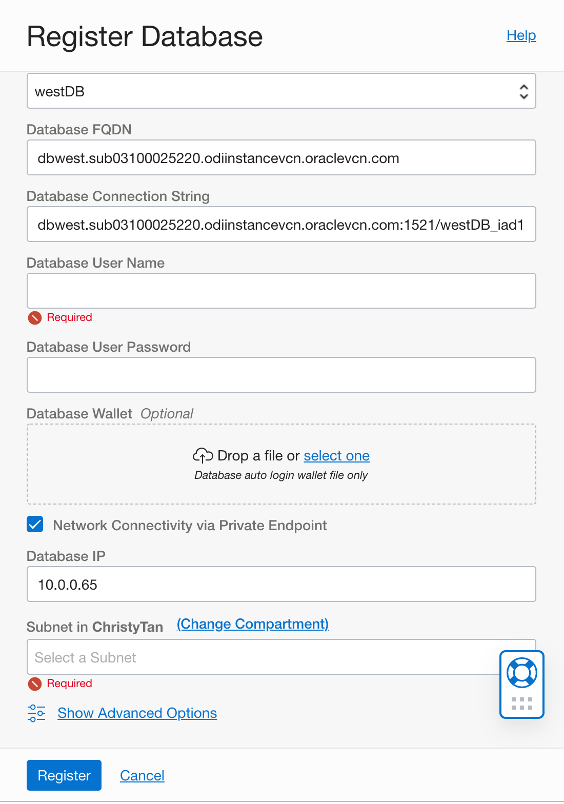
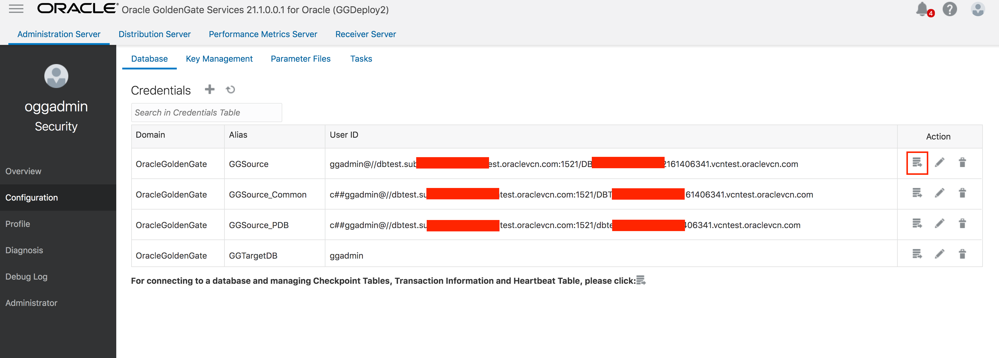
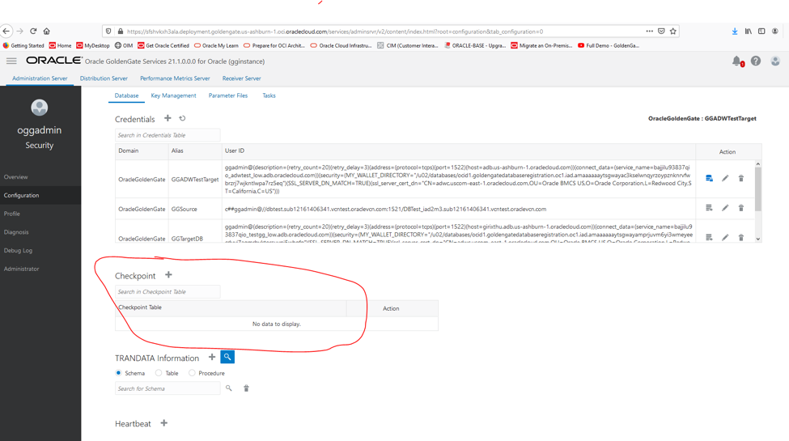
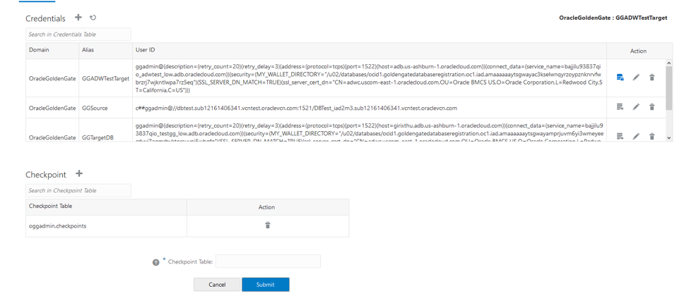
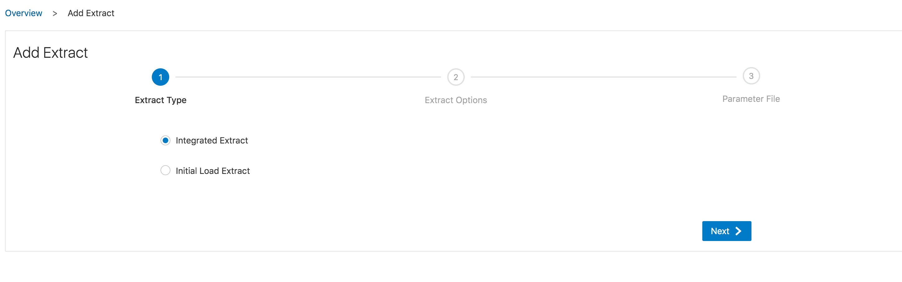
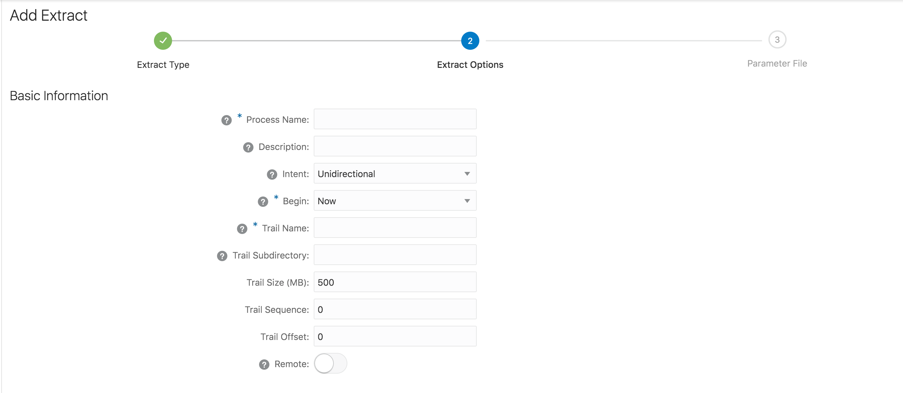
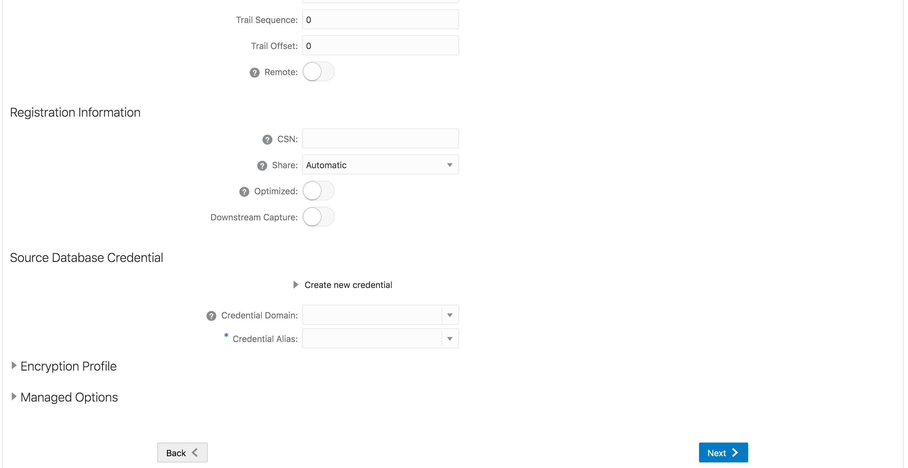
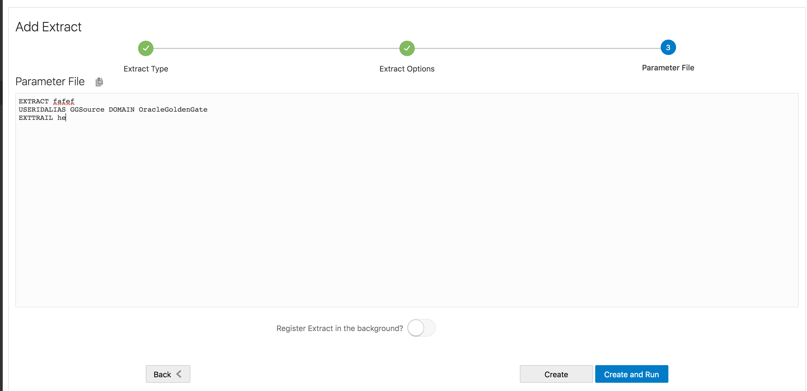

# Deploy Oracle GoldenGate Cloud Service

## Introduction

Data Replication is a essential part of your efforts and tasks when you are migrating your Oracle databases. While data migration can be acheived in many ways, there are fewer options when downtime tolerance is low and live, trickle feed replication may be the only way. Oracle Cloud Infrastructure Marketplace provides a goldengate microservice that can easily be setup for logical data replication between a variety of databases. In this hands-on lab we will setup goldengate to replicate data from a 19c Oracle database comparable to an 'on-prem' source database to an 19c  database in OCI. This approach is recommended while migrating most production or business critical application to DBCS .

Why Golden Gate?

- Oracle Golden Gate is an enterprise grade tool which can provide near real time data replication from one database to another. 
- Oracle GoldenGate offers a real-time, log-based change data capture (CDC) and replication software platform to meet the needs of today’s transaction-driven applications. It provides capture, routing, transformation, and delivery of transactional data across heterogeneous environments in real time can be acheived using Golden Gate. 
- Oracle GoldenGate only captures and moves committed database transactions to insure that transactional integrity is maintained at all times. The application carefully ensures the integrity of data as it is moved from the source database or messaging system, and is applied to any number of target databases or messaging systems.

[Learn More](http://www.oracle.com/us/products/middleware/data-integration/oracle-goldengate-realtime-access-2031152.pdf)

To **log issues**, click [here](https://github.com/oracle/learning-library/issues/new) to go to the github oracle repository issue submission form.

## Objectives

- Setup real time data replication from on-premise database to database cloud service.

## Required Artifacts

- Access to an Oracle Cloud Infrastructure tenancy.
- Access to an Oracle 19c database configured as source database.
- An database cloud service 19c as target database.
- Access to cloud virtual network.


## Background and Architecture

- There are three components to this lab. The **source database** that you are planning to migrate to database cloud service, the **target database cloud service** in OCI and an instance of **Oracle GoldenGate** server with access to both source and target databases.

- The source database can be any Oracle database version 19c or higher with at least one application schema that you wish to replicate to an database in OCI. For the purpose of this lab, you may provision a 19c DBCS instance in your compartment in OCI and configure it as source. 


- The Golden Gate cloud service is going to be deployed on OCI in a public network which has access to both the source database and the target database via the Goldengate instance in OCI.

- Let us understand the architecture of the setup we have here:
    - We have a source database on a VM on OCI(DBCS) which will act as an on-premise database.
    - We have a target database on an database cloud service VM on OCI.
    - We have a Goldengate instance with access to both the source database and target database.

   

## Steps
### **STEP 1: Provision a Goldengate Cloud Service from OCI**
1. Connect to your OCI tenancy and select **GoldenGate** from top left menu.


2. Click on **Create Deployment** to deploy the goldengate service.


3. Create Deployment and choose name, compartment, network, admin and admin password for the deployment.


4. Click on **Launch Console** to access GoldenGate Service.


5. Login on GoldenGate service.


### **STEP 2: Configure the source database**
It is assumed that you either have an Oracle 19c database configred as source or know how to provision a 19c DBCS instance on OCI

[This Medium blog provides step by step directions to deploying a DBCS instance in OCI](https://medium.com/@fathi.ria/oracle-database-on-oci-cloud-ee144b86648c)

The source database requires a Common (CDB) user that has DBA privileges over all PDBs in that database.

Lets also assume that the schema we wish to replicate with GoldenGate is the 'VSTEST' in DBTEST1_PDB1. So for a freshly provisioned DBCS instance as source, we create the common user and application schema as follows

1. Connect as sys to your source DB and execute the following SQL commands
```
sql > create user c##ggadmin identified by <password>;
sql > GRANT CREATE SESSION, ALTER SESSION TO c##ggadmin;
sql > grant CREATE cluster to c##ggadmin;
sql > grant CREATE indextype to c##ggadmin;
sql > grant CREATE operator to c##ggadmin;
sql > grant CREATE procedure to c##ggadmin;
sql > grant CREATE sequence to c##ggadmin;
sql > grant CREATE table to c##ggadmin;
sql > grant CREATE trigger to c##ggadmin;
sql > GRANT CREATE TYPE TO c##ggadmin;
sql > GRANT CREATE ANY TABLE TO c##ggadmin;
sql > GRANT ALTER ANY TABLE TO c##ggadmin;
sql > GRANT LOCK ANY TABLE TO c##ggadmin;
sql > GRANT SELECT ANY TABLE TO c##ggadmin;
sql > GRANT INSERT ANY TABLE TO c##ggadmin;
sql > GRANT UPDATE ANY TABLE TO c##ggadmin;
sql > GRANT DELETE ANY TABLE TO c##ggadmin;
sql > GRANT RESOURCE TO c##ggadmin;
sql > GRANT FLASHBACK ANY TABLE TO c##ggadmin;
sql > grant UNLIMITED TABLESPACE TO c##ggadmin;
sql > grant quota unlimited on users to c##ggadmin;
```
2. Grant user c##ggadmin GoldenGate admin privilege
```
sql > alter user c##ggadmin set container_data=all container=current;
--------------------------------
-- Must Have 
--------------------------------
sql > grant connect, resource to c##ggadmin container=ALL;
sql > grant create session, alter session to c##ggadmin container=ALL;
sql > grant dba to c##ggadmin container=ALL;

-- Used to enable database logging, start/register extracts
sql > grant alter system to c##ggadmin container=ALL;

sql > grant select_catalog_role to c##ggadmin;
sql > grant set container to c##ggadmin container = ALL;
sql > grant select any dictionary to c##ggadmin container = ALL;

PL/SQL >
BEGIN
 dbms_goldengate_auth.grant_admin_privilege
 (
 grantee => 'C##GGADMIN',
 privilege_type => 'CAPTURE',
 grant_select_privileges => TRUE,
 do_grants => TRUE,
 container => 'ALL'
 );
END;
--------------------------------
-- Must Have Conditional
--------------------------------
-- Used when you need to add trandata. 
sql > grant alter any table to c##ggadmin container=ALL;

```

3. Set user c##ggadmin unlimited password and unlock user
- Confirm user c##ggadmin password expiration date
```
sql > select username, account_status, EXPIRY_DATE from dba_users where username='C##GGADMIN';
```
- Use profile DEFAULT
```
sql > alter profile DEFAULT limit PASSWORD_REUSE_TIME unlimited;
sql > alter profile DEFAULT limit PASSWORD_LIFE_TIME  unlimited;
sql > alter user C##GGADMIN IDENTIFIED BY <password>;
sql > alter user C##GGADMIN profile DEFAULT;

```

- Unlock user c##ggadmin 
```
sql > select username,account_status from dba_users where account_status like '%EXPIRED%'
or account_status like '%LOCKED%';

-- if c##ggadmin user is locked, unlock user

sql > ALTER USER C##GGADMIN ACCOUNT UNLOCK;
```
4. Create a schema user **VSTEST** in PDB to replicate data. A sample 'DEMO' table is provided here. You may add one or more table of your choice to the VSTEST.

```
sql > alter session set container=DBTEST_PDB1;
sql > create user VSTEST identified by <password>;
sql > grant create session to VSTEST;
sql > grant alter session to VSTEST;
sql > connect, resource, dba to VESTEST;

sql >  CREATE TABLE "VSTEST"."DEMO" 
   (	"INVOICE_ID" VARCHAR2(26 BYTE), 
	"BRANCH" VARCHAR2(26 BYTE), 
	"CITY" VARCHAR2(26 BYTE), 
	"CUSTOMER_TYPE" VARCHAR2(26 BYTE), 
	"GENDER" VARCHAR2(26 BYTE), 
	"PRODUCT_LINE" VARCHAR2(26 BYTE), 
	"UNIT_PRICE" NUMBER(38,2), 
	"QUANTITY" NUMBER(38,0), 
	"TAX" NUMBER(38,4), 
	"TOTAL" NUMBER(38,4), 
	"DATEE" DATE, 
	"TIME" VARCHAR2(26 BYTE), 
	"PAYMENT" VARCHAR2(26 BYTE), 
	"COGS" NUMBER(38,2), 
	"GROSS_MARGIN_PERCENTAGE" NUMBER(38,9), 
	"GROSS_INCOME" NUMBER(38,4), 
	"RATING" NUMBER(38,1)
   )
sql > alter user VSTEST quita unlimited on users;
```
The source database is all set. Next, lets setup the target database instance.

### **STEP 3: Configure the target database**
1. Connect to the database instance created earlier as user **sys** as sysdba
- Create a common user in database instance and grant necesary previliges.
```
sql > create user c##ggadmin identified by <password>;
sql > grant connect, resource, dba to c##ggadmin;
sql > alter database add supplemental log data;

sql > alter user c##ggadmin set container_data=all container=current;
--------------------------------
-- Must Have 
--------------------------------
sql > grant connect, resource to c##ggadmin container=ALL;
sql > grant create session, alter session to c##ggadmin container=ALL;
sql > grant dba to c##ggadmin container=ALL;

-- Used to enable database logging, start/register extracts
sql > grant alter system to c##ggadmin container=ALL;

sql > grant select_catalog_role to c##ggadmin;
sql > grant set container to c##ggadmin container = ALL;
sql > grant select any dictionary to c##ggadmin container = ALL;

PL/SQL >
BEGIN
 dbms_goldengate_auth.grant_admin_privilege
 (
 grantee => 'C##GGADMIN',
 privilege_type => 'CAPTURE',
 grant_select_privileges => TRUE,
 do_grants => TRUE,
 container => 'ALL'
 );
END;
--------------------------------
-- Must Have Conditional
--------------------------------
-- Used when you need to add trandata. 
sql > grant alter any table to c##ggadmin container=ALL;

```

2. Create an **VSTEST** user similar to source and create the same set of tables as source. Also we will create a goldengate admin user and grant necessary previliges to that user.

```
sql > alter session set container=DBTEST_PDB1;
sql > create user VSTEST identified by <password>;
sql > grant create session to VSTEST;
sql > grant alter session to VSTEST;
sql > connect, resource, dba to VESTEST;

sql >  CREATE TABLE "VSTEST"."DEMO" 
   (	"INVOICE_ID" VARCHAR2(26 BYTE), 
	"BRANCH" VARCHAR2(26 BYTE), 
	"CITY" VARCHAR2(26 BYTE), 
	"CUSTOMER_TYPE" VARCHAR2(26 BYTE), 
	"GENDER" VARCHAR2(26 BYTE), 
	"PRODUCT_LINE" VARCHAR2(26 BYTE), 
	"UNIT_PRICE" NUMBER(38,2), 
	"QUANTITY" NUMBER(38,0), 
	"TAX" NUMBER(38,4), 
	"TOTAL" NUMBER(38,4), 
	"DATEE" DATE, 
	"TIME" VARCHAR2(26 BYTE), 
	"PAYMENT" VARCHAR2(26 BYTE), 
	"COGS" NUMBER(38,2), 
	"GROSS_MARGIN_PERCENTAGE" NUMBER(38,9), 
	"GROSS_INCOME" NUMBER(38,4), 
	"RATING" NUMBER(38,1)
   )
sql > alter user VSTEST quita unlimited on users;
```

Now, your target Database is ready!

### **STEP 4: Configure Goldengate Cloud Service**

#### **STEP 4.1: Register Database** ####

1. On OCI console navigate to **Home**, **GoldenGate** from top left menu and **choose your compartment**

2. Launch your GoldenGate instance and fill goldengate username and password.


3. Once logged on GoldenGate Services console, You need to register source and target database then configure **Extracts**, **Replicats** and **Distribution Server**. 

4. If your database is either OCI Database, Autonomous database or Exadata database on OCI, please return back to GoldenGate Deployment console, and **Registered Databases** on the top left panel. If your database is non-OCI database, please skip step 4 and 5.


5. Click **Register database** to register source and target database.



```
Name: name of your database.
Alias name: database Alias, will be used in the GoldenGate configuration.
Description: discription of your registered database.
Compartment: compartment where your database located.
Select Database or Enter Database Information: you can either choose to manual fill in database information or system would automatically fill in.
Database Type: Autonomous Database, DB System Database(Bare Metal, VM, Exadata) or VM Cluster Database (Exadata).
Database in Compartment: choose the database in selected compartment.
Database FQDN: database full qualified domain name.
Database user name: your database user.
Database user password: your database user password.
Network Connectivity via Private Endpoint: checked for connectivity between deployment and database remains private.
```
6. If your database is non-OCI database, please register database within GoldenGate console. Navigate to **Configuration** on the top left menu.

7. click **+** after Credentials.
```
Credential Domain: name for database credential domain
Credential Alias: Alias name for database Credentials
User ID: database user Identity. e.g. database\_username@//db\_domain\_name:1521/DB\_FQDN

```
8. You can verify connection by click icon from **Action**.


9. Add default credentials for GoldenGate. Do not need to test connection. It will fail with no TNS details.
```
Credential Domain: OracleGoldenGate
Alias: oggadmin
User ID: oggadmin
```

10. Add **Checkpoint table** for both source and target database.



#### **STEP 4.2: Create Extracts** ####

1. click **+** on **Extracts**.
```
Integrated Extract: Interacts directly with a database logmining server to receive data changes in the form of logical change records (LCR).
Initial Load: data would be read over from source table to target table. Target table should be empty while performing initial load.
```


2. Add Extract


```
Process Name: Extract name.
Description: Description of current extract.
Intent:Intent for data capture workflow.
Begin: Starting time for data processing.
Trail Name: Name of Extract trail name.
Source Database Credential: database credential.
```
3. Edit Parameter File

```
EXTRACT extract_name
USERIDALIAS Alias_name DOMAIN credentail_domain_name
EXTTRAIL extract_trail_file_name
SOURCECATALOG database_name;
table schema.tablename;
table schema.tablename2;
table schema.tablename3;
table schema.tablename4;
```
This one ensure that all changes are being captured while extract is being completed so that the primary replicat will start applying these changes.


